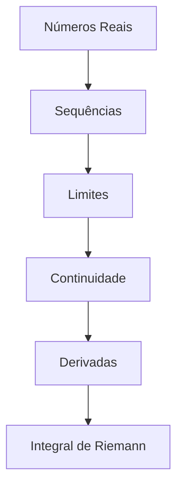

> [!quote] _"A matemática é a linguagem na qual Deus escreveu o universo."_ - Galileu Galilei

---

## 🎯 **Bem-vindo à Análise Real**

Este vault é dedicado ao estudo de **Análise 1** (Análise Real), uma das disciplinas mais fundamentais da matemática superior. Aqui você encontrará uma abordagem estruturada e rigorosa dos conceitos que formam a base do cálculo e da análise matemática moderna.

---

## 📚 **Estrutura do Curso**

### 🏗️ **Fundamentos**

---

## 🎯 **Objetivos de Aprendizagem**

### 🎯 **Ao final deste curso, você será capaz de:**

- Compreender rigorosamente os **números reais** e suas propriedades
- Trabalhar com **sequências e séries** com precisão matemática
- Dominar o conceito de **limite** em sua forma mais geral
- Analisar **continuidade** e suas implicações
- Aplicar o **Teorema do Valor Médio** e suas consequências
- Construir a **integral de Riemann** a partir dos primeiros princípios

---

## 📖 **Conteúdo Detalhado**

### 🔢 **1. Sistema dos Números Reais**

- [[Axiomas dos Números Reais]]
- [[Propriedade do Supremo]]
- [[Densidade dos Racionais]]
- [[Princípio de Arquimedes]]
- [[Números Irracionais]]

### 📈 **2. Sequências**

- [[Definição de Sequência]]
- [[Convergência de Sequências]]
- [[Teorema do Confronto]]
- [[Sequências de Cauchy]]
- [[Teorema de Bolzano-Weierstrass]]

### ♾️ **3. Séries Numéricas**

- [[Séries Absolutamente convergentes]]
- [[Testes de Convergência]]
- [[Teste das Séries Alternadas]]
- [[Convergência Absoluta]]
- [[Séries Absolutamente convergentes]]
- [[Rearranjos de Séries]]

### 🎯 **4. Limites de Funções**

- [[Definição ε-δ de Limite]]
- [[Limites Laterais]]
- [[Teoremas sobre Limites]]
- [[Limites no Infinito]]
- [[Limites Infinitos]]

### 🔄 **5. Continuidade**

- [[Definição de Continuidade]]
- [[Teorema do Valor Intermediário]]
- [[Continuidade em Compactos]]
- [[Continuidade Uniforme]]
- [[Descontinuidades]]

### 📊 **6. Derivadas**

- [[Definição de Derivada]]
- [[Regras de Derivação]]
- [[Teorema do Valor Médio]]
- [[Teorema de Rolle]]
- [[Aplicações da Derivada]]

### 📐 **7. Integral de Riemann**

- [[Partições e Somas de Riemann]]
- [[Definição da Integral]]
- [[Critério de Integrabilidade]]
- [[Teorema Fundamental do Cálculo]]
- [[Técnicas de Integração]]
## 📝 **Ferramentas de Estudo**

### 📚 **Bibliografia Principal**

- **Rudin** - Principles of Mathematical Analysis
- **Bartle & Sherbert** - Introduction to Real Analysis
- **Abbott** - Understanding Analysis
- **Lima** - Curso de Análise Real

---

## ⚡ **Dicas de Estudo**

> [!tip] **Para Demonstrações**
> 
> 1. Sempre comece com as definições
> 2. Identifique o que precisa ser provado
> 3. Trabalhe tanto "para frente" quanto "para trás"
> 4. Use exemplos para ganhar intuição

> [!warning] **Erros Comuns**
> 
> - Confundir convergência pontual com uniforme
> - Não verificar as hipóteses dos teoremas
> - Usar propriedades antes de demonstrá-las

---
## 🔍 **Navegação Rápida**

### 🏷️ **Tags Principais**

- `#teorema` - Teoremas importantes
- `#definicao` - Definições fundamentais
- `#demonstracao` - Provas detalhadas
- `#exercicio` - Problemas resolvidos
- `#exemplo` - Exemplos ilustrativos

## 💡 **Citação Motivacional**

> [!quote] **Lembrete Diário** _"Em matemática, você não entende as coisas. Você apenas se acostuma com elas."_ - John von Neumann
> 
> **Seja paciente consigo mesmo. A Análise Real requer tempo e dedicação!** 🧠✨

---

_Tags_: #matematica #analise #real #calculo #universidade #teoria