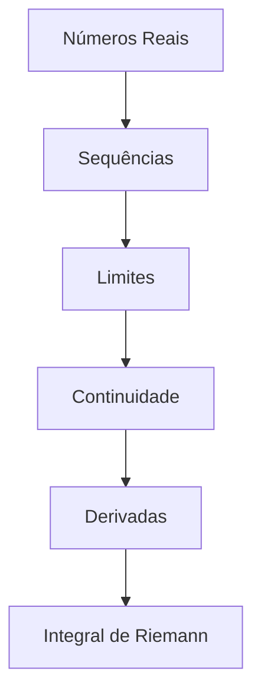

> [!quote] _"A matemática é a linguagem na qual Deus escreveu o universo."_ - Galileu Galilei

---
## 🎯 **Bem-vindo à Análise Real**

Este vault é dedicado ao estudo de **Análise 1** (Análise Real), uma das disciplinas mais fundamentais da matemática superior. Aqui você encontrará uma abordagem estruturada e rigorosa dos conceitos que formam a base do cálculo e da análise matemática moderna.

---

## 📚 **Estrutura do Curso**

### 🏗️ **Fundamentos**

---

## 🎯 **Objetivos de Aprendizagem**

- Compreender rigorosamente os **números reais** e suas propriedades
- Trabalhar com **sequências e séries** com precisão matemática
- Dominar o conceito de **limite** em sua forma mais geral
- Analisar **continuidade** e suas implicações
- Aplicar o **Teorema do Valor Médio** e suas consequências
- Construir a **integral de Riemann** a partir dos primeiros princípios

# 📚 Análise 1 - Estrutura da Disciplina

## 1. Derivadas
- [[Definição de Derivada]]
- [[Regras de Derivação]]
- [[Derivadas de Ordem Superior]]
- [[Derivadas de Funções Elementares]]
- [[Regra da Cadeia]]
- [[Derivação Implícita]]
- [[Taxas Relacionadas]]

## 2. Integral
- [[Definição de Integral]]
- [[Integral de Riemann]]
- [[Teorema Fundamental do Cálculo]]
- [[Técnicas de Integração]]
- [[Integração por Substituição]]
- [[Integração por Partes]]
- [[Integração por Frações Parciais]]
- [[Integrais Impróprias]]

## 3. Limites
- [[Cálculo/Cálculo 1/limite/Limites]]
- [[Definição ε-δ de Limite]]
- [[Teoremas sobre Limites]]
- [[Propriedades dos Limites]]
- [[Limites Fundamentais]]

### 3.1 Funções Contínuas em Intervalos
- [[Definição de Continuidade]]
- [[Continuidade em Intervalos]]
- [[Teorema do Valor Intermediário]]
- [[Teorema de Weierstrass]]
- [[Continuidade Uniforme]]

### 3.2 Limite de Funções
- [[Cálculo/Cálculo 1/limite/Limite de Funções]]
- [[Operações com Limites]]
- [[Limites Trigonométricos]]
- [[Limites Exponenciais e Logarítmicos]]

### 3.3 Limites Infinitos
- [[Cálculo/Cálculo 1/limite/Limites Infinitos]]
- [[Assíntotas Verticais]]
- [[Limites com Tendência ao Infinito]]
- [[Comparação de Infinitos]]

### 3.4 Limites Laterais
- [[Cálculo/Cálculo 1/limite/Limites Laterais]]
- [[Limite à Direita]]
- [[Limite à Esquerda]]
- [[Existência do Limite]]

## 4. Números

### 4.1 Conjuntos
- [[Conjunto]]
- [[Conjunto Aberto]]
- [[Conjunto Convexo]]
- [[Conjunto Enumerável]]
- [[Conjunto Fechado]]
- [[Conjunto Finito]]
- [[Conjunto Ilimitado]]
- [[Conjunto Infinito]]
- [[Conjunto Limitado]]
- [[Conjunto Não Enumerável]]
- [[Subconjuntos]]
- [[Operações entre Conjuntos]]

### 4.2 Corpos
- [[Corpos]]
- [[Corpo Ordenado]]
- [[Corpo Completo]]
- [[Axiomas de Corpo]]
- [[Corpo dos Números Reais]]

### 4.3 Inteiros
- [[Inteiros]]
- [[Números Inteiros]]
- [[Relação de Ordem nos Inteiros]]
- [[Divisibilidade em Z]]
- [[Princípio da Boa Ordenação]] (PBO)

### 4.4 Reais
- [[Reais]]
- [[Números Reais]]
- [[Axiomas dos Números Reais]]
- [[Propriedade do Supremo]]
- [[Densidade dos Racionais]]
- [[Princípio de Arquimedes]]
- [[Números Irracionais]]

### 4.5 PBO (Princípio da Boa Ordenação)
- [[Princípio da Boa Ordenação]]
- [[Indução Finita]]
- [[Aplicações do PBO]]

## 5. Sequências
- [[Definição de Sequência]]
- [[Notação de Sequências]]
- [[Convergência de Sequências]]
- [[Limite de Sequência]]
- [[Sequências Monótonas]]
- [[Sequências Limitadas]]
- [[Teorema do Confronto para Sequências]]
- [[Sequências de Cauchy]]
- [[Subsequências]]
- [[Teorema de Bolzano-Weierstrass]]
- [[Sequências Recursivas]]

## 6. Séries

### 6.1 Séries Absolutamente Convergentes
- [[Séries Absolutamente convergentes]]
- [[Convergência Absoluta]]
- [[Critério da Raiz]]
- [[Critério da Razão]]
- [[Teste da Comparação]]

### 6.2 Testes das Séries
- [[Testes de Convergência]]
- [[Teste da Divergência]]
- [[Teste da Comparação no Limite]]
- [[Teste da Integral]]
- [[Teste da Razão (D'Alembert)]]
- [[Teste da Raiz (Cauchy)]]
- [[Teste das Séries Alternadas]]
- [[Teste de Leibniz]]

## 📌 Notas Adicionais (Não listados na imagem mas complementares)

- [[Série Geométrica]]
- [[Série Harmônica]]
- [[Série-p]]
- [[Rearranjos de Séries]]
- [[Séries de Potências]]
- [[Raio de Convergência]]

---

Essa é a **lista reorganizada** com base na estrutura da sua imagem. Posso também:

1. Gerar os arquivos `.md` vazios para cada um desses links
2. Reorganizar em outra ordem
3. Adicionar subníveis diferentes
4. Criar um arquivo `Índice.md` com todos esses links

Qual você prefere?
## 📝 **Ferramentas de Estudo**

### 📚 **Bibliografia Principal**

- **Rudin** - Principles of Mathematical Analysis
- **Bartle & Sherbert** - Introduction to Real Analysis
- **Abbott** - Understanding Analysis
- **Lima** - Curso de Análise Real

---

## ⚡ **Dicas de Estudo**

> [!tip] **Para Demonstrações**
> 
> 1. Sempre comece com as definições
> 2. Identifique o que precisa ser provado
> 3. Trabalhe tanto "para frente" quanto "para trás"
> 4. Use exemplos para ganhar intuição

> [!warning] **Erros Comuns**
> 
> - Confundir convergência pontual com uniforme
> - Não verificar as hipóteses dos teoremas
> - Usar propriedades antes de demonstrá-las

---
## 🔍 **Navegação Rápida**

### 🏷️ **Tags Principais**

- `#teorema` - Teoremas importantes
- `#definicao` - Definições fundamentais
- `#demonstracao` - Provas detalhadas
- `#exercicio` - Problemas resolvidos
- `#exemplo` - Exemplos ilustrativos

## 💡 **Citação Motivacional**

> [!quote] **Lembrete Diário** _"Em matemática, você não entende as coisas. Você apenas se acostuma com elas."_ - John von Neumann
> 
> **Seja paciente consigo mesmo. A Análise Real requer tempo e dedicação!** 🧠✨

---

_Tags_: #matematica #analise #real #calculo #universidade #teoria