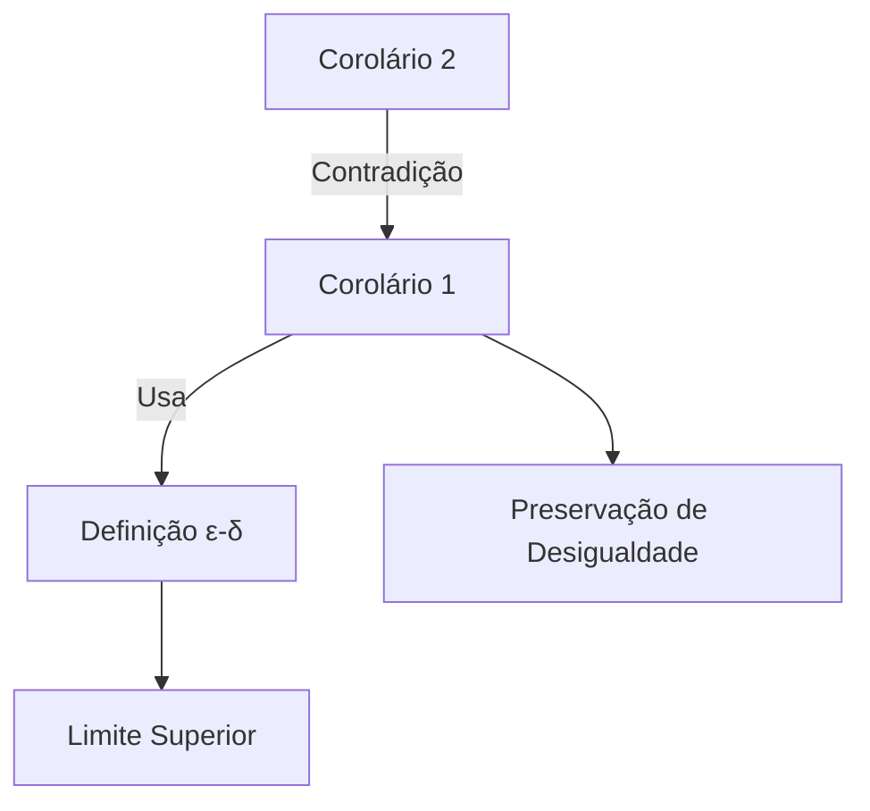

# Definição de Limite em Cálculo

> [!abstract] Conceito Intuitivo
> Em cálculo, **limite** descreve o valor que uma função ou sequência se aproxima quando a entrada (ou índice) tende a um determinado ponto.

## Definição Formal (ε-δ)

Seja \( f \) uma função definida em um intervalo aberto contendo \( a \) (exceto possivelmente em \( a \)). Dizemos que:

$$
\lim_{x \to a} f(x) = L
$$

**Se e somente se**:

> Para todo $\epsilon > 0$, existe um $\delta > 0$ tal que:
> 
> $$ 0 < |x - a| < \delta \implies |f(x) - L| < \epsilon $$

### Elementos da Definição:
- **$\epsilon$ (épsilon)**: Margem de erro aceitável para $f(x)$ em relação a $L$
- **$\delta$ (delta)**: Distância máxima permitida de $x$ a $a$
- **$L$**: Valor do limite

## Representação Gráfica

> [!example] Exemplo Prático
> Provar que $\lim_{x \to 2} (3x-1) = 5$:
> 1. Dado $\epsilon > 0$, escolha $\delta = \epsilon/3$
> 2. Se $0 < |x-2| < \delta$, então:
>    $$ |(3x-1)-5| = 3|x-2| < 3\delta = \epsilon $$

## Propriedades dos Limites
1. **Unicidade**: O limite (quando existe) é único
2. **Linearidade**:
   $$ \lim_{x \to a} [αf(x) + βg(x)] = αL + βM $$
3. **Produto**:
   $$ \lim_{x \to a} [f(x)g(x)] = L \cdot M $$

---

> [!abstract] ## Definição em analise
> Sejam $X \subset \mathbb{R}$, $a \in X'$ e $f: X -> \mathbb{R}$. Dizemos que $L \in \mathbb{R}$ é o limite de $f(x)$ quando $x$ tende a $a$e escrevemos$$\lim_{x->a} f(x) = L$$
> 
> Quando para todo $\epsilon > 0$, existe um $\delta > 0$ tal que $$x \in X\text{ , } 0 < |x-a| < \epsilon => |f(x) - L| < \epsilon$$

> [!example]
>  $$\lim_{x->a} x = a$$

> [!example] 
> $$\lim_{x->a} c = c$$

## Teorema
> [!note]
> Sejam $f(x)$, $g(x)$ : $X -> \mathbb{R}$, $a \in X'$,$\lim_{x->a} f(x) = L$ e $\lim_{x->a} g(x) = M$
> 
> Se L < M, existem um $\delta > 0$ tal que $$f(x) < g(x)\text{ , par a todo } x \in (a\delta, a+\delta) \cap (X - \{a\})$$

### Prova do Teorema da Comparação de Limites

**Hipóteses**:
- Sejam $f, g: X \to \mathbb{R}$
- $a \in X'$ (ponto de acumulação)
- $\lim_{x\to a} f(x) = L$
- $\lim_{x\to a} g(x) = M$
- $L < M$

**Tese**:
$\exists \delta > 0$ tal que $f(x) < g(x)$ para todo $x \in (a-\delta,a+\delta) \cap (X\setminus\{a\})$

**Prova**:

1. Tome $\epsilon = \frac{M-L}{2} > 0$ (pois $M > L$)

2. Pela definição de limite:
   - Para $f$: $\exists \delta_1 > 0$ tal que se $0 < |x-a| < \delta_1$ então $|f(x)-L| < \epsilon$  
     $\Rightarrow f(x) < L + \epsilon$ $(1)$
   
   - Para $g$: $\exists \delta_2 > 0$ tal que se $0 < |x-a| < \delta_2$ então $|g(x)-M| < \epsilon$  
     $\Rightarrow g(x) > M - \epsilon$ $(2)$

3. Seja $\delta = \min(\delta_1, \delta_2)$. Para $x \in (a-\delta,a+\delta)\cap(X\setminus\{a\})$:

$$
\begin{align*}
L + \epsilon &= L + \frac{M-L}{2} = \frac{L+M}{2} \\
M - \epsilon &= M - \frac{M-L}{2} = \frac{L+M}{2}
\end{align*}
$$

4. De $(1)$ e $(2)$:

$$
f(x) < \frac{L+M}{2} < g(x)
$$

**Conclusão**:
$\boxed{\forall x \in (a-\delta,a+\delta)\cap(X\setminus\{a\}), f(x) < g(x)}$

# Corolários sobre Limites de Funções

## Corolário 1 (Limite Superior)

> [!note] 
> **Se** $\lim_{x \to a} f(x) = L < M$,  
> **Então** existe $\delta > 0$ tal que:
> $$f(x) < M \quad \forall x \in (a - \delta, a + \delta) \cap (X \setminus \{a\})$$

### Prova
1. **Escolha de ε**:  
   Tome $\epsilon = M - L > 0$ (pois $L < M$ por hipótese).

2. **Definição de limite**:  
   $\exists \delta > 0$ tal que:
   $$0 < |x - a| < \delta \implies |f(x) - L| < \epsilon$$

3. **Desenvolvimento**:  
   \begin{align*}
   f(x) &< L + \epsilon \\
        &= L + (M - L) \\
        &= M
   \end{align*}

4. **Conclusão**:  
   $$\boxed{f(x) < M \text{ na vizinhança perfurada}}$$

---

## Corolário 2 (Preservação de Desigualdade)

> [!note] 
> **Se**:
> - $\lim_{x \to a} f(x) = L$
> - $\lim_{x \to a} g(x) = M$
> - $\exists \delta > 0$ com $f(x) < g(x)$ em $(a - \delta, a + \delta) \cap (X \setminus \{a\})$  
> 
> **Então**:
> $$L \leq M$$

### Prova por Contradição
1. **Hipótese de absurdo**:  
   Suponha $L > M$.

2. **Aplicação do Corolário 1**:  
   Existe $\delta_1 > 0$ tal que:
   $$g(x) < L \quad \forall x \in (a - \delta_1, a + \delta_1) \cap (X \setminus \{a\})$$

3. **Interseção de vizinhanças**:  
   Tome $\delta^* = \min(\delta, \delta_1)$. Para $x$ na vizinhança perfurada:
   \begin{align*}
   f(x) &< g(x) \quad \text{(por hipótese)} \\
   g(x) &< L \quad \text{(pelo Corolário 1)}
   \end{align*}
   $$\Rightarrow f(x) < L$$

4. **Contradição**:  
   Isso viola $\lim_{x \to a} f(x) = L$ (pois $f(x)$ deveria se aproximar de $L$ por ambos os lados).

5. **Conclusão**:  
   $$\boxed{L \leq M}$$

---

### Diagrama de Ideias (Mermaid)

> [!warning] Observação
> - Ambos os corolários dependem **criticamente** da definição formal de limite.
> - O Corolário 2 é fundamental para provar teoremas de comparação em análise.
> - O teorema e os corolários são válidos se trocarmos < ( ou <=) por > ( ou >=)

##  Teorema do Sanduíche (Teorema do Confronto)

> [!theorem] Enunciado Formal
> Sejam  $f, g, h : X \to \mathbb{R}$ funções e $a \in X'$. Suponha que:
> 1. $f(x) \leq g(x) \leq h(x)$ para todo $x \in X \setminus \{a\}$ em uma vizinhança de $a$
> 2. $\lim_{x \to a} f(x) = \lim_{x \to a} h(x) = L$
> 
> **Então**:
> $$ \lim_{x \to a} g(x) = L $$
### Hipóteses Revisadas
1. **Desigualdade Tripla**:  
   $\exists \delta_0 > 0$ tal que para todo $x \in (a-\delta_0,a+\delta_0) \cap (X\setminus\{a\})$:  
   $$f(x) \leq g(x) \leq h(x)$$

2. **Convergência das Funções Externas**:  
   $$\lim_{x \to a} f(x) = \lim_{x \to a} h(x) = L$$

## Prova Detalhada

### Passo 1: Construção dos δ's
Para um $\epsilon > 0$ arbitrário:
1. **Para $f(x)$**:  
   $\exists \delta_1 > 0$ tal que:  
   $$0 < |x-a| < \delta_1 \implies L - \epsilon < f(x) < L + \epsilon$$

2. **Para $h(x)$**:  
   $\exists \delta_2 > 0$ tal que:  
   $$0 < |x-a| < \delta_2 \implies L - \epsilon < h(x) < L + \epsilon$$

### Passo 2: Vizinhança Crítica
Defina $\delta = \min\{\delta_0, \delta_1, \delta_2\}$. Para $x$ satisfazendo $0 < |x-a| < \delta$:

1. **Limites Inferior e Superior**:  
   $$\begin{align*}
   L - \epsilon &< f(x) \quad \text{(por $\delta_1$)} \\
   h(x) &< L + \epsilon \quad \text{(por $\delta_2$)}
   \end{align*}$$

2. **Sanduíche Estrutural**:  
   Usando a hipótese 1:  
   $$\underbrace{L - \epsilon}_{f(x)} < \underbrace{f(x)}_{\leq g(x)} \leq g(x) \leq \underbrace{h(x)}_{< L + \epsilon} < \underbrace{L + \epsilon}_{h(x)}$$

### Passo 3: Conclusão Final
Para estes $x$:  
$$|g(x) - L| < \epsilon$$

> [!qed] Portanto  
> $$\boxed{\lim_{x \to a} g(x) = L}$$

## Caso de Aplicação
**Exemplo**:  
Prove que $\lim_{x \to 0} x^2 \sin\left(\frac{1}{x}\right) = 0$.

1. **Limitantes**:  
   $-x^2 \leq x^2 \sin\left(\frac{1}{x}\right) \leq x^2$

2. **Limites**:  
   $\lim_{x \to 0} -x^2 = \lim_{x \to 0} x^2 = 0$

3. **Aplicação do Teorema**:  
   O resultado segue imediatamente.

## Teorema da Limitação Local

> [!theorem]
> **Se** $\lim_{x \to a} f(x) = L$ existe,  
> **Então** existe uma vizinhança $(a - \delta, a + \delta)$ onde $f$ é limitada.

### Prova (ε-δ)

1. **Pela definição de limite**:  
   Para $\epsilon = 1$, $\exists \delta > 0$ tal que:
   $$0 < |x - a| < \delta \implies |f(x) - L| < 1$$

2. **Desenvolvendo a desigualdade**:  
   \begin{align*}
   -1 &< f(x) - L < 1 \\
   L - 1 &< f(x) < L + 1
   \end{align*}

3. **Limitantes explícitos**:  
   - Limitante inferior: $m = L - 1$
   - Limitante superior: $M = L + 1$

4. **Conclusão**:  
   $$\boxed{\exists M, m \in \mathbb{R} \text{ tais que } m < f(x) < M \text{ para } x \in (a - \delta, a + \delta) \setminus \{a\}}$$

> [!example] ## Exemplo Ilustrativo
> 
> **Considere**:  
$$f(x) = \frac{x^2 - 1}{x - 1}$$  
> em $x = 1$.
> 
> 1. **Limite**:  
   $$\lim_{x \to 1} f(x) = 2 \quad \text{(simplificando para } x \neq 1\text{)}$$
> 
> 2. **Aplicação do teorema**:  
 >  - Tome $\epsilon = 1$: existe $\delta > 0$ tal que para $0 < |x - 1| < \delta$: $$1 < f(x) < 3$$
>
> 3. **Verificação**:  
 >  - Para $x = 1.1$: $f(x) = 2.1$  
 >  - Para $x = 0.9$: $f(x) = 1.9$  
 >  (ambos satisfazem $1 < f(x) < 3$)

## Caso Patológico (Não-Exemplo)

**Função**:  
$$g(x) = \frac{1}{x}$$  
em $x = 0$.

- **Não existe** $\lim_{x \to 0} g(x)$  
- **Não é** limitada em vizinhança alguma de $0$  
- Ilustra a **necessidade** da existência do limite no teorema

---
## Teorema da Caracterização Sequencial de Limites

> [!theorem]
> Seja $f: X \to \mathbb{R}$ e $a \in X'$. São equivalentes:
> 1. $\lim_{x \to a} f(x) = L$
> 2. Para toda sequência $(x_n)$ em $X \setminus \{a\}$ com $\lim_{n \to \infty} x_n = a$, tem-se $\lim_{n \to \infty} f(x_n) = L$

## Prova (Dupla Implicação)

### Parte 1 (⇒): Limite funcional ⇒ Limite sequencial
**Hipótese**: $\lim_{x \to a} f(x) = L$

1. Seja $(x_n)$ sequência em $X \setminus \{a\}$ com $\lim_{n \to \infty} x_n = a$
2. Dado $\epsilon > 0$, existe $\delta > 0$ tal que:
   $$ 0 < |x - a| < \delta \implies |f(x) - L| < \epsilon $$
3. Como $x_n \to a$, para $n \geq N$ temos $0 < |x_n - a| < \delta$
4. Logo, para $n \geq N$:
   $$ |f(x_n) - L| < \epsilon $$
   $$\boxed{\lim_{n \to \infty} f(x_n) = L}$$

### Parte 2 (⇐): Limite sequencial ⇒ Limite funcional (por contradição)
**Hipótese**: Toda sequência convergente satisfaz $f(x_n) \to L$

1. Suponha por absurdo que $\lim_{x \to a} f(x) \neq L$
2. Então existe $\epsilon_0 > 0$ tal que para todo $\delta = 1/n$, existe $x_n$ com:
   $$ 0 < |x_n - a| < 1/n \quad \text{e} \quad |f(x_n) - L| \geq \epsilon_0 $$
3. Construímos assim uma sequência $(x_n)$ em $X \setminus \{a\}$ com:
   - $x_n \to a$ pois ($|x_n - a| < 1/n$)
   - Mas $f(x_n) \not\to L$ (contradição com a hipótese)
1. Portanto:
   $$\boxed{\lim_{x \to a} f(x) = L}$$

## Diagrama Conceitual

## Exemplo Ilustrativo
**Considere** $f(x) = \frac{\sin x}{x}$ em $a = 0$:

1. **Via sequências**: Para qualquer $x_n \to 0$, temos $f(x_n) \to 1$
2. **Conclusão**: $\lim_{x \to 0} \frac{\sin x}{x} = 1$

## Aplicações
1. Provar a **não existência** de limites
2. Estender resultados de sequências para funções
3. Fundamentar definições em espaços métricos

> [!warning] Atenção
> A condição \( a \in X' \) (ponto de acumulação) é essencial para garantir a existência de sequências não constantes em \( X \setminus \{a\} \)
