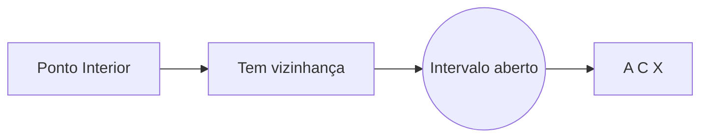
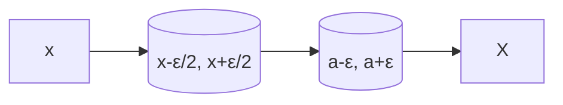
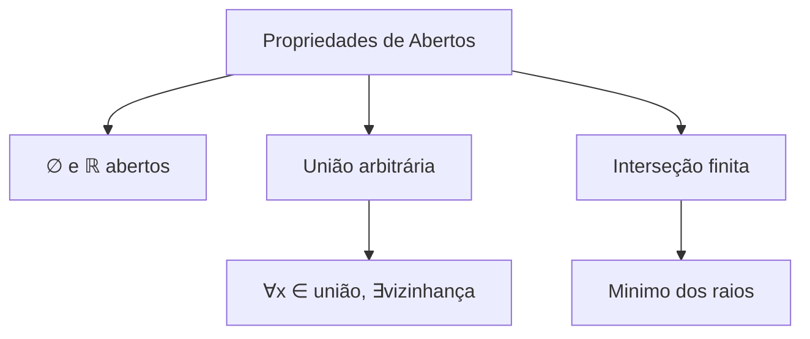

> [!note] **Ponto Interior**
> Dado um conjunto $X \subseteq \mathbb{R}$, um ponto $a \in \mathbb{R}$ é chamado de **ponto interior** de $X$ se: $$
> \exists \epsilon > 0 \text{ tal que } (a - \epsilon, a + \epsilon) \subset X$$
> **Notação**: $a \in \text{int}(X)$

> [!tip] **Definição Equivalente de Ponto Interior**  
> Dado $X \subseteq \mathbb{R}$ e $a \in \mathbb{R}$, a afirmação:  
> $$
> \exists \epsilon > 0 \text{ tal que } (a-\epsilon, a+\epsilon) \subset X
> $$  
> é equivalente a:  
> $$
> \exists (c,d) \text{ aberto tal que } a \in (c,d) \subset X
> $$  
> **Observação**: Basta tomar $(c,d) = (a-\epsilon, a+\epsilon)$ para ver a equivalência.
### Elementos Adicionais (Opcionais):

> [!info] Conjunto dos pontos interioes
> Esse conjunto é chamado de interior de um cinjunto, no qual ele está contido e é denotado por $int(X)$ 
> 
> Qunado $a \in int(X)$, dizemos que $X$ é uma **Vizinhança de $a$**

> [!warning] OBS
>  -  $int(X) \subset X$
>  - Se $X \Subset Y$, então $int(X) \subset int(Y)$

# Definição

> [!definition] Conjunto Aberto
> Dizemos que $A\subset \mathbb{R}$ é aberto quando
> $$ int(A) = A$$

> [!example] Exemplos
>  - Todo Ponto $c$ do intervalo $(a,b)$ é **Ponto Interior** a $(a,b)$. Logo, $(a,b)$ é um conjunto aberto
>  -  Para $a < b$ 
> $$ int[a,b] = int(a,b] = int[a,b) = (a,b)$$
>  - $int(\mathbb{Q}) = \varnothing$ e $int(\mathbb{R} - \mathbb{Q}) = \varnothing$
#### proposição
> [!proposition] **Propriedade do Operador Interior**  
> Para qualquer conjunto $X \subseteq \mathbb{R}$, vale:  
> $$  
> \text{int}(\text{int}(X)) = \text{int}(X)  
> $$  
> **Consequência imediata**:  
> $\text{int}(X)$ é sempre um conjunto aberto.

> [!proof] **Demonstração de Propriedade do Interior**  
> Dado $a \in \text{int}(X)$, por definição existe $\epsilon > 0$ tal que:  
> $$
> (a - \epsilon, a + \epsilon) \subset X  
> $$  
>  
> **Passo crucial**: Para qualquer $x \in \left(a - \frac{\epsilon}{2}, a + \frac{\epsilon}{2}\right)$, temos:  
> $$  
> \left(x - \frac{\epsilon}{2}, x + \frac{\epsilon}{2}\right) \subset (a - \epsilon, a + \epsilon) \subset X  
> $$  
> 
> Logo:$$x \in int(X)$$ Como $x \in \left(a - \frac{\epsilon}{2}, a + \frac{\epsilon}{2}\right)$ é arbitrário, concluímos que: $$\left(a - \frac{\epsilon}{2}, a + \frac{\epsilon}{2}\right) \subset int(X)$$
> Assim:$$a \in \left(a - \frac{\epsilon}{2}, a + \frac{\epsilon}{2}\right) \subset int(X)$$
> 
> Como mostramos que:  
> $$
> \forall a \in \text{int}(X), \exists \epsilon > 0 \text{ tal que } (a-\epsilon, a+\epsilon) \subset \text{int}(X)
> $$
> Segue que:  
> $$ 
> a \in \text{int}(\text{int}(X))
> $$ 
> **Portanto**:  
> $$
> \text{int}(X) \subseteq \text{int}(\text{int}(X))
> $$
> **Conclusão**:  
> Todo $x$ na vizinhança reduzida pertence a $\text{int}(X)$, pois possui sua própria vizinhança contida em $X$. 
> 
### Diagrama de Inclusão:  

> [!abstract] Forma resumida
> 1. $\text{int}(X) \subseteq X \Rightarrow \text{int}(\text{int}(X)) \subseteq \text{int}(X)$  
> 2. Se $x \in \text{int}(X)$, existe $\epsilon > 0$ com $(x-\epsilon, x+\epsilon) \subseteq X$.  
   Como $(x-\epsilon, x+\epsilon)$ é aberto, todos seus pontos são interiores a $X$, logo:  
   $(x-\epsilon, x+\epsilon) \subseteq \text{int}(X)$.  
   Portanto, $x \in \text{int}(\text{int}(X))$.
   
## Teorema: Propriedades Fundamentais de Conjuntos Abertos em ℝ

## Enunciado
1. **Casos básicos**:
   - ∅ (conjunto vazio) e ℝ são conjuntos abertos

2. **União arbitrária**:
   - Se {Aₗ}ₗ∈ᴸ é uma família arbitrária de conjuntos abertos, então:
    $$
     \bigcup_{λ ∈ Λ} A_λ \text{ é aberto}
     $$

3. **Interseção finita**:
   - Se A₁, A₂, ..., Aₙ são abertos, então:
    $$
     \bigcap_{k=1}^n A_k \text{ é aberto}
    $$

## Prova

### 1) ∅ e ℝ são abertos
- **∅ é aberto**: Verdadeiro por vacuidade (não há pontos para verificar)
- **ℝ é aberto**: ∀x ∈ ℝ, (x-1, x+1) ⊂ ℝ

### 2) União arbitrária de abertos
Seja x ∈ ⋃ₗ Aₗ. Então:
- ∃λ₀ ∈ Λ tal que x ∈ Aₗ₀
- Como Aₗ₀ é aberto, ∃ε > 0 com (x-ε, x+ε) ⊂ Aₗ₀ ⊂ ⋃ₗ Aₗ
- Logo ⋃ₗ Aₗ é aberto

### 3) Interseção finita de abertos
Seja x ∈ ⋂ₖ₌₁ⁿ Aₖ. Para cada k:
- ∃εₖ > 0 tal que (x-εₖ, x+εₖ) ⊂ Aₖ
- Tome ε = min{ε₁, ..., εₙ} > 0
- Então (x-ε, x+ε) ⊂ ⋂ₖ₌₁ⁿ Aₖ
- Logo ⋂ₖ₌₁ⁿ Aₖ é aberto

veja o próximo conteudo em [[Conjunto fechado]]