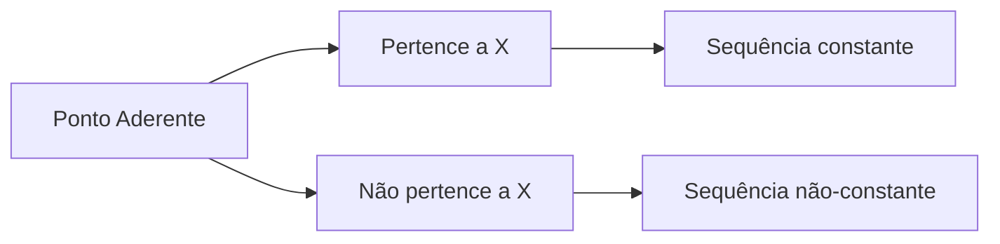

> [!definition] **Ponto Aderente**
> Dado um conjunto $X \subset \mathbb{R}$, dizemos que $a \in \mathbb{R}$ é um **ponto aderente** de $X$ quando:
> $$
> \exists (x_n)_{n \in \mathbb{N}} \subseteq X \text{ tal que } \lim_{n \to \infty} x_n = a
> $$

> [!example] **Caso Especial**
> Se $a = \lim x_n$ com $x_n \in X$ e $x_n = a$ para todo $n$, então:
> $$
> a \in X \text{ (pois a sequência é constante)}
> $$

> [!note] **Observações Importantes**
> 1. Todo ponto de $X$ é aderente (basta tomar a sequência constante)
> 2. O conjunto dos pontos aderentes de $X$ é exatamente o **fecho** $\overline{X}$
> 3. Pontos aderentes podem pertencer ou não a $X$

> [!example] **Exemplos de Pontos Aderentes**
>
> ### 🧪 Caso 1: Ponto que pertence a $X$ (sequência constante)  
> Para $X = [0,1]$ e $a = 0{,}5$: tome $x_n = 0{,}5$ (constante), então $\lim x_n = 0{,}5 \in X$.
>
> ---
>
> ### 🧪 Caso 2: Ponto fora de $X$ (sequência convergente)  
> Para $X = (0,1)$ e $a = 0$: tome $x_n = \frac{1}{n}$, então $\lim x_n = 0 \notin X$.
>
> ---
>
> ### 🧪 Caso 3: Ponto isolado  
> Para $X = \{1\} \cup \{1 + \frac{1}{n} \mid n \in \mathbb{N}\}$ e $a = 1$: tome $x_n = 1$ (constante), então $\lim x_n = 1 \in X$.

### Propriedades

> [!note] **Propriedade Fundamental**
> O fecho $\overline{X}$ contém:
> - Todos os pontos de $X$
> -  Se $X \subset Y$ então $\overline{X} \subset \overline{Y}$
> - Todos os limites de sequências convergentes em $X$

**Exemplo Construtivo**:
- Para $X = \mathbb{Q} \cap [0,1]$, todo $a \in [0,1]$ é aderente (via aproximação decimal)

**Contraexemplo**:
- Se $X = \mathbb{Z}$, nenhum $a \notin \mathbb{Z}$ é aderente

> [!theorem] **Caracterização Alternativa**
> $a$ é aderente a $X$ se e somente se:
> $$
> \forall \epsilon > 0, \quad X \cap (a-\epsilon, a+\epsilon) \neq \emptyset
> $$

> [!definition] CONJUNTO FECHADO
> dizemos que $F \subset R$ é fechado quando $$F = \overline{F}$$

> [!example]+ EXEMPLO
>  O fecho do intervalo $[a,b]$ é o prórpio $[a,b]$. Portanto, [a,b] é um conjunto fechado
> [!theorem]+ **Teorema de Caracterização de Pontos Aderentes**
> Um ponto $a \in \mathbb{R}$ é aderente a $X \subset \mathbb{R}$ se, e somente se:
> $$
> \forall (c,d) \text{ aberto com } a \in (c,d), \quad (c,d) \cap X \neq \emptyset
> $$
> 
> OUTRO EXEMPLO
> $\overline{[a,b)} = \overline{(a,b]} = \overline{(a,b)} = [a,b]$
> 
> MAIS UM EXEMPLO
> 
> Se $X \subset \mathbb{R}$ é limitado, então o $inf(X)$ e $sup(X)$ são pontos aderentes a $X$

> [!theorem] Um ponto $a \in \mathbb{R}$ é aderente a $X$ se, e smente se, todo intervao aberto que contém $a$ contém algum ponto de $X$.

> [!proof] **Demonstração**
> 
> **($\Rightarrow$) Suponha $a$ aderente**:
> - Existe $(x_n) \subseteq X$ com $x_n \to a$
> - Para qualquer $(c,d) \ni a$, como $x_n \to a$, $\exists n_0 \in \mathbb{N}$ tal que:
> $$calc \forall n \geq n_0, \quad x_n \in (c,d) $$
> - Logo, $(c,d) \cap X \neq \emptyset$ $\quad\square$
> 
> **($\Leftarrow$) Construção da sequência**:
> - Para cada $n \in \mathbb{N}$, tome:
> $$ x_n \in \left(a - \frac{1}{n}, a + \frac{1}{n}\right) \cap X $$
> - Então $|x_n - a| < \frac{1}{n} \to 0$, portanto:
> $$ \lim_{n \to \infty} x_n = a \quad\square$$ 
> ### Exemplo Imediato
> Para $X = (0,1)$:
> - $0$ é aderente (tome $x_n = \frac{1}{n}$)
> - $1$ é aderente (tome $x_n = 1 - \frac{1}{n}$)
> - $\frac{1}{2}$ é aderente (tome $x_n = \frac{1}{2}$ constante)

> [!theorem] **Idempotência do Operador Fechamento**
> Para todo $X \subseteq \mathbb{R}$, vale:
> $$
> \overline{\overline{X}} = \overline{X}
> $$

> [!proof] **Demonstração**
> 
> **1. $\overline{X} \subseteq \overline{\overline{X}}$**  
> - Segue diretamente da definição de fecho
> 
> **2. $\overline{\overline{X}} \subseteq \overline{X}$**  
> - Tome $a \in \overline{\overline{X}}$
> - Existe $(x_n) \subseteq \overline{X}$ com $\lim{x_n} \to a$
> - Para cada $x_n$, existe $(y_k^{(n)}) \subseteq X$ tal que $y_k^{(n)} \to x_n$
> - Construa a sequência diagonal $z_n = y_n^{(n)}$:
>   $$
>   \|z_n - a\| \leq \|y_n^{(n)} - x_n\| + \|x_n - a\| \to 0 $$
> - Logo $a \in \overline{X}$ $\quad\square$
> 
> Supondo por absurso que $a \not{\in} \overline{X}$. Então, existe $\epsilon > 0$ tal que $(a - \epsilon, a+ \epsilon ) \cap X \not{=} = \emptyset$
> 
> Por outro lado, como $a = lim{x_n}$, $x_n \in \overline{X}$, existe $n_0 \in \mathbb{N}$ tal que $$n > n_0 => x_n \in (a - \epsilon, a + \epsilon)$$
> Fixando $n> n_0$, temos: $x \in X$  e tambem $$x_n \in (a - \epsilon, a + \epsilon)$$
> 
> Logo, existe $$x_n \in (a - \epsilon, a + \epsilon) \cap X$$
> que é uma contradição, portanto $a \in \overline{X}$ e assim os $\overline{\overline{X}} = \overline{X}$ são iguais

> [!theorem] **Caracterização de Conjuntos Fechados**
> Um conjunto $F \subset \mathbb{R}$ é fechado se, e somente se, $\mathbb{R} - F$ é aberto.
> 
> **Demonstração ($\Leftarrow$): Supondo $\mathbb{R} \subset F$ aberto**
> 1. **Objetivo**: Mostrar que $F$ contém todos seus pontos aderentes.
> 
> 2. **Argumento principal**:
>    - Seja $a \in \mathbb{R} - F$ um ponto aderente a $F$ com $a \not \in \overline{F}$.
>    - Por contradição: suponha $a \notin F$ $\Rightarrow$ $a \in \mathbb{R} - F$ (que é aberto por hipótese).
>    - Logo, existe $\epsilon > 0$ tal que:
>      $$
>      (a - \epsilon, a + \epsilon) \subset \mathbb{R} \setminus F
>      $$
>    - Isto implica $(a - \epsilon, a + \epsilon) \cap F = \emptyset$, ou mesmo que $a \in int(\mathbb{R} - F)$, contradizendo $a$ ser aderente a $F$.
> 
> 3. **Conclusão**:
>    - Necessariamente $a \in F$ $\quad\square$.

> [!example] **Exemplo Imediato**
> - $F = [0,1]$ é fechado pois $\mathbb{R} \setminus F = (-\infty,0) \cup (1,\infty)$ é aberto.
> - Contraexemplo: $F = (0,1]$ não é fechado, pois $\mathbb{R} \setminus F = (-\infty,0] \cup (1,\infty)$ não é aberto (devido ao ponto $0$).

> [!example] **Exemplo Prático**
> Seja $X = \mathbb{Q} \cap (0,1)$:
> $$
> \overline{X} = [0,1] \\
> \overline{\overline{X}} = \overline{[0,1]} = [0,1]
> $$

> [!colorario] $\mathbb{R}$ e vazio são fechados

Se ${F_{\lambda}}_{\lambda \in L}$ é uma família arbitraria de conjuntos fechados, então $$
F = \bigcap_{\lambda \in L} F_\lambda$$é fechado

Se $F_1 , F_2,  \cdots , F_{n}$ são fechados o que implica que a união entre eles é aberta.

## PONTO DE FRONTEIRA

> [!note] Dado um conjunto $X \subset \mathbb{R}$
> Dizemos que $a \in \mathbb{R}$ é um **PONTO DE FRONTEIRA** de $X$ quando _todo intervalo aberto de I $I$ que contém $a$ também comtém algum ponto de $X$_ e algum ponto de $\mathbb{R} - $X$

Seja $X \subseteq \mathbb{R}$. Dizemos que $a \in \mathbb{R}$ é um **ponto de fronteira** de $X$ se:$$
\forall \varepsilon > 0,\ (a - \varepsilon,\ a + \varepsilon) \cap X \neq \emptyset \quad$$ AO MESMO TEMPO QUE  $$\quad (a - \varepsilon,\ a + \varepsilon) \cap (\mathbb{R} \setminus X) \neq \emptyset.
$$
> [!warning] o ponto de fronteira é denotado por $fr(X)$ 

> [!example] EXEMPLOS 
>  - $fr(\emptyset) = \emptyset$
>  - $fr(\mathbb{R}) = \emptyset$
>  - $fr(\mathbb{Q}) = fr(\mathbb{R} - \mathbb{Q}) = \mathbb{R}$
>  - $fr(a,b) = fr[a,b) = fr(a,b] = fr[a,b] = fr{a,b = {a,b}}$
>  - Se $X$ é finito, então $fr(X) = X$

> [!warning] Observação  
> Para todo $X \subset \mathbb{R}$, os conjuntos $\operatorname{int}(X)$ e $\operatorname{fr}(X)$ são distintos, e:
> $$
> X \subset \operatorname{int}(X) \cup \operatorname{fr}(X)
> $$

> [!summary] $F \subset \mathbb{R}$ é fechado se, e somente se, $fr(F) \subset F$
> ## DEMONSTRAÇÃO
> Seja  $F \subset \mathbb{R}$ é fechado dado que $a \in fr(F)$, temos que $a$ é aderente a F,ou seja, $a \in \overline{F} = F$
> Logo $a \in F$
> 
> Supondo a volta que $fr(F) \subset F$
> Se $F$ fosse fechado, existira $a \in \overline{F} - F$
> Assim, todo intervalo aberto $I$ que contém $a$, contaria algum ponto $x \in F$. Logo, teriamos $$I \cap F \neq \emptyset \quad \text{e também  }I \cap (\mathbb{R} F) \neq \emptyset \quad $$ Logo $a \in F$, o que seria uma contradição. Portanto $F$ é fechado.

## PONTO DE ACUMULAÇÃO
> [!info]  PONTO DE ACUMULAÇÃO
> Dado $X \in \mathbb{R}$, dizemos que $a \in \mathbb{R}$ é o *Ponto de acumulação* de $X$ quando todo intervalo aberto de $I$ que contém $a$, contém também algum ponto de X diferente de $a$. Em resumo, quando isso acontece: $$I \cap (X - {{a}}) \neq \emptyset \quad$$

Equivalentemente, $a \in \mathbb{R}$ é um **ponto de aderência** de $X$ se:

$$
\forall \varepsilon > 0,\ (a - \varepsilon,\ a + \varepsilon) \cap (X \setminus \{a\}) \neq \emptyset.
$$
> [!attention]  Denotamos por $X'$ o conjunto dos pontos de acumulação de $X$.

Note que:
$$
a \in X' \iff \forall \varepsilon > 0,\ (a - \varepsilon, a + \varepsilon) \cap (X \setminus \{a\}) \neq \emptyset
$$
> [!important] Se $a \in X$, não é P.A de X, dizemos que $a$ é um **Ponto Isolado** de $X$

> [!info] Quando todos os pontos de $X$ são isolados, dizemos que $X$ é um conjunto discreto

> [!example] Exemplos
>  - Se $X$ é finito, então $X' \neq \emptyset \quad$
>  - $mathbb{Z}$ é discreto
>  - $mathbb{Q}$ ' = $\mathbb{R}$
>  - Se $X = {1, \cdots, 1/n}$, então $X'$ = {0}

### TEOREMA  
> [!summary] São equivalentes as seguintes afirmações:
>
> - $a$ é ponto de aderência de $X$.
> - $a$ é limite de uma sequência $(x_n) \subseteq X - \{a\}$.
> - Todo intervalo aberto centrado em $a$ contém infinitos pontos de $X$.

---
## 🧪 Provas das equivalências

Vamos mostrar que:

1. (1)⇒(2)(1) \Rightarrow (2),
    
2. (2)⇒(3)(2) \Rightarrow (3),
    
3. (3)⇒(1)(3) \Rightarrow (1).
    

---
### 📍**(1) ⇒ (2)**

**Se aa é ponto de aderência de XX, então existe uma sequência (xn)⊆X∖{a}(x_n) \subseteq X \setminus \{a\} tal que xn→ax_n \to a.**

Como $a$ é ponto de aderência de $X$, temos:

$$
\forall \varepsilon > 0, (a - \varepsilon, a + \varepsilon) \cap (X \setminus \{a\}) \neq \emptyset.
$$

Ou seja, para cada $n \in \mathbb{N}$, tome $\varepsilon = \frac{1}{n}$. Então, existe $x_n \in X \setminus \{a\}$ tal que:

$$
x_n \in (a - \tfrac{1}{n},\ a + \tfrac{1}{n}).
$$

Logo, a sequência $(x_n)$ converge para $a$, com $x_n \in X \setminus \{a\}$.

---

### 📍**(2) ⇒ (3)**

**Se existe uma sequência $(x_{n})⊆X∖{a}(x_{n}) \subseteq X \setminus \{a\} tal que xn→ax_n \to a$, então todo intervalo aberto centrado em aa contém infinitos pontos de XX.**

Seja $(x_n) \subseteq X \setminus \{a\}$ tal que $x_n \to a$.

Então, para todo $\varepsilon > 0$, existe $N \in \mathbb{N}$ tal que para todo $n \geq N$, temos:

$$
|x_n - a| < \varepsilon \Rightarrow x_n \in (a - \varepsilon, a + \varepsilon).
$$

Logo, o intervalo $(a - \varepsilon, a + \varepsilon)$ contém infinitos termos da sequência $(x_n)$, e portanto, contém infinitos pontos de $X$.

### 📍**(3) ⇒ (1)**

**Se todo intervalo aberto centrado em aa contém infinitos pontos de XX, então aa é ponto de aderência de XX.**

Seja $\varepsilon > 0$. Como, por hipótese, o intervalo $(a - \varepsilon, a + \varepsilon)$ contém infinitos pontos de $X$, então certamente:

$$
(a - \varepsilon, a + \varepsilon) \cap (X \setminus \{a\}) \neq \emptyset.
$$

Ou seja, $a$ satisfaz a condição de ponto de aderência:

$$
\forall \varepsilon > 0,\ (a - \varepsilon, a + \varepsilon) \cap (X \setminus \{a\}) \neq \emptyset.
$$

Portanto, $a \in X'$, isto é, $a$ é ponto de aderência de $X$.

---

**Tags**: #topologia #análise-real #fecho