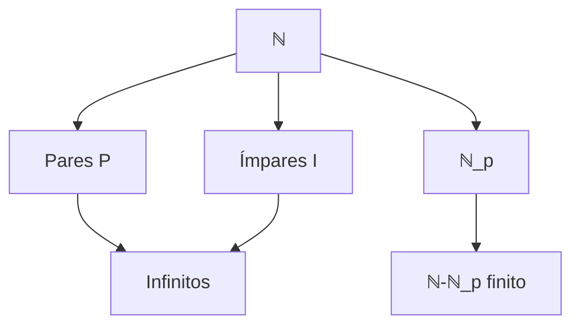

Um Conjunto que não é  Fiinito, ou seja ,
## Exemplos Fundamentais
$$
\mathbb{N} \text{ é infinito} \quad \text{e} \quad k\mathbb{N} = \{k, 2k, 3k, \ldots\} \text{ também é infinito}
$$

## Teorema 3 (Existência de Função Injetiva)
**Enunciado**:
> Se X é infinito, ∃f: ℕ → X injetiva

**Prova Construtiva**:
1. Escolha axiomática: ∀A ⊆ X não-vazio, selecione xₐ ∈ A
2. Definição indutiva:
   - Base: f(1) = x_X
   - Passo: f(n+1) = x_{A_n} onde A_n = X - {f(1),...,f(n)}
3. Injetividade:
   - Se m < n então f(m) ∈ {f(1),...,f(n-1)} mas f(n) ∉

## Corolário (Caracterização de Infinito)
**Equivalência**:
$$
X \text{ infinito} ⇔ ∃φ: X → Y \text{ bijeção com } Y ⊂ X \text{ próprio}
$$

**Explicação**:
1. (⇒) Construção explícita:
   - Tome f: ℕ → X injetiva
   - Defina Y = X - {f(1)}
   - Bijecção φ:$$
     φ(x) = \begin{cases}
     f(n+1) & \text{se } x = f(n) \\
     x & \text{caso contrário}
     \end{cases}
     $$

2. (⇐) Contrapositivo: finito ⇒ não existe tal bijeção

## Casos Notáveis
### Bijeções com Subconjuntos Próprios
1. **Naturais sem o 1**:
 $$
   φ: ℕ → ℕ_1, φ(n) = n + 1
$$
2. **Naturais a partir de p**:$$
   φ: ℕ → ℕ_p, φ(n) = n + p
 $$
3. **Números Pares** (Galileu):
$$
   φ: ℕ → P, φ(n) = 2n
$$
4. **Números Ímpares**:
$$
   ψ: ℕ → I, ψ(n) = 2n - 1
$$

### Propriedades

**Tags**: #teoria-dos-conjuntos #infinito #cardinalidade #matemática
