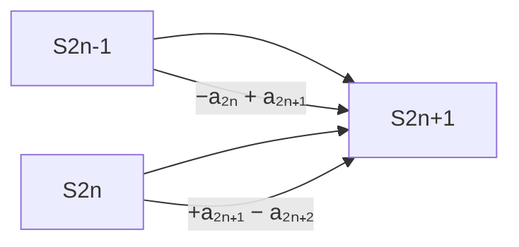
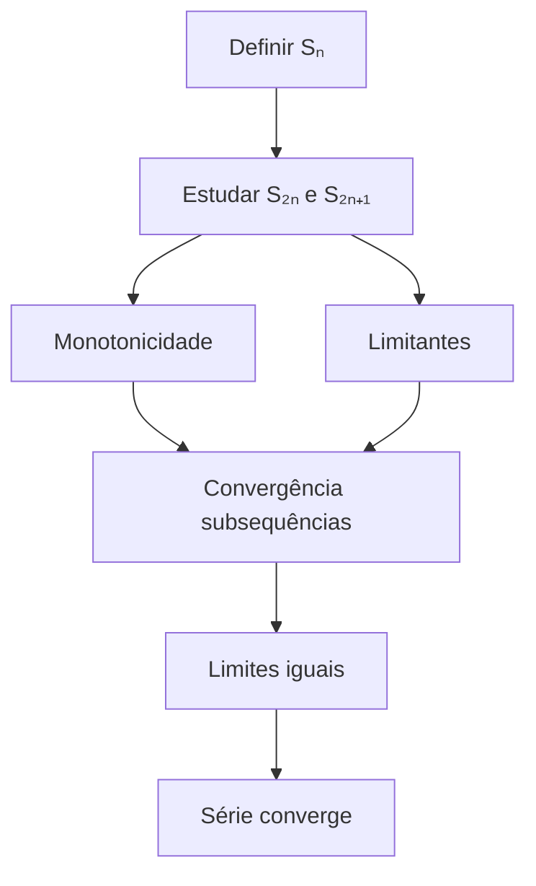

Se $(a_n)$ é uma sequência não cresente com $\lim{a_n} = 0$ , então a série

Então, a série alternada:$$
\sum_{n=1}^{\infty} (-1)^{n+1} a_n = a_1 - a_2 + a_3 - a_4 + \cdots$$
É convergente, porém **não é absolutamente convergente**

## Prova
Seja $$S_n = a_1 - a_2 +a_3 - a_4 + \cdots + (-1)^{n+1}a_n$$
Então $$S_{2n + 1} = S_{2n -1} - a_{2n} + a_{2n + 1}$$ e com isso $$S_{2n + 2} =  S_{2n} + a_{2n+ 1} - a_{2n + 2}$$
Além disso:      $S_{2n} = S_{2n + 1} - a_{2n} <= S_{2n - 1}$ 
Assim:$$ S_2 <= S_ 4 <= \cdots <= S_{2n} <= S_{2n - 1} <= \cdots <= S_3 <= S_1$$
Logo existem $$ S' = \lim{S_{2n - 1}} \text{ e tambem }S'' = lim{S_{{2n}}}$$
Como:$$\lim{a_n} = 0$$
Temos, $$\lim{S_{2n}} = \lim{S_{2n - 1}} - \lim{a_n} = \lim{S_{2n - 1}}$$Portanto $(S_n)$ é Convergente. Dessa forma, todos o membros de ordem apar serão maiores do que os membros de ordem impar
### Para termos ímpares (2n+1):
$$
S_{2n+1} = S_{2n-1} - a_{2n} + a_{2n+1}
$$

### Para termos pares (2n):
$$
S_{2n+1} = S_{2n} + a_{2n+1} - a_{2n+2}
$$

## Diagrama de Construção das Somas

## Estrutura Completa da Prova

