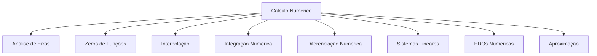
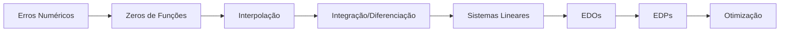

# 🧮 Cálculo Numérico

> [!info] Visão Geral O Cálculo Numérico é a área da matemática aplicada que desenvolve algoritmos para resolver problemas matemáticos usando aproximações numéricas, essencial quando soluções analíticas exatas são impossíveis ou impraticáveis.

---

## 🎯 Mapa de Conceitos

---

## 📊 Índice de Conteúdos

### 1. 🎲 Análise de Erros e Precisão Numérica

- [[Tipos de Erros Numéricos]]
- [[Propagação de Erros]]
- [[Arredondamento e Truncamento]]
- [[Representação de Números em Ponto Flutuante]]
- [[Estabilidade Numérica]]
- [[Condicionamento de Problemas]]
- [[Número de Condição]]
- [[Análise de Convergência]]

> [!warning] Cuidado com Erros A análise de erros é fundamental - um algoritmo matematicamente correto pode ser numericamente instável!

### 2. 🎯 Zeros de Funções (Métodos de Raízes)

- [[Método da Bisseção]]
- [[Método de Newton-Raphson]]
- [[Método da Secante]]
- [[Método da Posição Falsa]]
- [[Método do Ponto Fixo]]
- [[Métodos para Polinômios]]
- [[Método de Horner]]
- [[Deflação Polinomial]]
- [[Zeros Múltiplos]]
- [[Critérios de Parada]]

#### 2.1 🔄 Métodos Iterativos Avançados

- [[Método de Aitken]]
- [[Aceleração de Convergência]]
- [[Método de Steffensen]]
- [[Zeros Complexos]]

> [!tip] Dica de Implementação Para o método de Newton, sempre verifique se f'(x) ≠ 0 para evitar divisão por zero!

### 3. 📈 Interpolação e Aproximação

- [[Interpolação Polinomial]]
- [[Polinômio de Lagrange]]
- [[Diferenças Divididas de Newton]]
- [[Fórmula de Newton Forward]]
- [[Fórmula de Newton Backward]]
- [[Interpolação de Hermite]]
- [[Splines Lineares]]
- [[Splines Cúbicas]]
- [[Splines Naturais]]
- [[Erro de Interpolação]]

#### 3.1 🎨 Aproximação por Mínimos Quadrados

- [[Ajuste Linear por Mínimos Quadrados]]
- [[Regressão Polinomial]]
- [[Aproximação Não-Linear]]
- [[Funções Ortogonais]]
- [[Aproximação de Chebyshev]]

> [!example] Exemplo Prático Splines cúbicas são ideais para interpolação suave de dados experimentais com muitos pontos.

### 4. ∫ Integração Numérica (Quadratura)

- [[Regra do Trapézio]]
- [[Regra de Simpson 1/3]]
- [[Regra de Simpson 3/8]]
- [[Fórmulas de Newton-Cotes]]
- [[Quadratura Gaussiana]]
- [[Integração Adaptativa]]
- [[Integração de Romberg]]
- [[Extrapolação de Richardson]]
- [[Integrais Impróprias Numéricas]]

#### 4.1 🌐 Integração Múltipla

- [[Integração Dupla Numérica]]
- [[Integração Tripla Numérica]]
- [[Métodos de Monte Carlo]]
- [[Quasi-Monte Carlo]]

> [!note] Precisão vs Eficiência Regra de Simpson: O(h⁴) vs Trapézio: O(h²), mas Simpson requer mais avaliações de função.

### 5. 📊 Diferenciação Numérica

- [[Diferenças Finitas]]
- [[Fórmulas de Diferença Forward]]
- [[Fórmulas de Diferença Backward]]
- [[Fórmulas de Diferença Central]]
- [[Derivadas de Ordem Superior]]
- [[Erro de Truncamento em Diferenciação]]
- [[Diferenciação de Dados Experimentais]]
- [[Suavização de Dados]]

### 6. 🧩 Sistemas de Equações Lineares

- [[Métodos Diretos vs Iterativos]]
- [[Eliminação Gaussiana]]
- [[Eliminação de Gauss-Jordan]]
- [[Decomposição LU]]
- [[Pivotamento Parcial]]
- [[Pivotamento Total]]
- [[Decomposição de Cholesky]]
- [[Decomposição QR]]

#### 6.1 🔄 Métodos Iterativos para Sistemas Lineares

- [[Método de Jacobi]]
- [[Método de Gauss-Seidel]]
- [[Método SOR (Successive Over-Relaxation)]]
- [[Gradiente Conjugado]]
- [[Métodos de Krylov]]
- [[GMRES]]
- [[BiCGSTAB]]

> [!success] Vantagens dos Métodos Iterativos
> 
> - Ideais para sistemas esparsos grandes
> - Menor uso de memória
> - Paralelizáveis

### 7. 🔍 Autovalores e Autovetores

- [[Problema de Autovalores]]
- [[Método das Potências]]
- [[Método das Potências Inverso]]
- [[Deslocamento Espectral]]
- [[Método QR]]
- [[Transformações de Householder]]
- [[Método de Jacobi para Matrizes Simétricas]]

### 8. 🌊 Equações Diferenciais Ordinárias (EDOs)

- [[Problemas de Valor Inicial]]
- [[Método de Euler]]
- [[Método de Euler Modificado]]
- [[Métodos de Runge-Kutta]]
- [[Runge-Kutta de 4ª Ordem]]
- [[Métodos Adaptativos]]
- [[Controle de Passo]]
- [[Sistemas de EDOs]]

#### 8.1 📐 Métodos Multi-passo

- [[Métodos de Adams-Bashforth]]
- [[Métodos de Adams-Moulton]]
- [[Métodos Preditor-Corretor]]
- [[Estabilidade de Métodos Numéricos]]

#### 8.2 🎭 Problemas de Valor de Contorno

- [[Método de Diferenças Finitas para PVC]]
- [[Método de Shooting]]
- [[Funções de Green Numéricas]]

### 9. 🌐 Equações Diferenciais Parciais (EDPs)

- [[Classificação de EDPs]]
- [[Método de Diferenças Finitas para EDPs]]
- [[Esquemas Explícitos e Implícitos]]
- [[Análise de Estabilidade CFL]]
- [[Método de Elementos Finitos (Introdução)]]
- [[Método dos Volumes Finitos]]

#### 9.1 ⚡ EDPs Específicas

- [[Equação do Calor Numérica]]
- [[Equação da Onda Numérica]]
- [[Equação de Laplace Numérica]]
- [[Equação de Poisson Numérica]]

### 10. 🎲 Otimização Numérica

- [[Otimização Unidimensional]]
- [[Busca Áurea]]
- [[Método de Newton para Otimização]]
- [[Gradiente Descendente]]
- [[Método de Quasi-Newton]]
- [[BFGS]]
- [[Levenberg-Marquardt]]
- [[Algoritmos Genéticos (Introdução)]]

---

## 🛠️ Ferramentas e Implementação

### 💻 Linguagens de Programação

- [[Python para Cálculo Numérico]]
    - NumPy, SciPy, matplotlib
- [[MATLAB/Octave]]
- [[C/C++ para Performance]]
- [[Julia para Computação Científica]]
- [[R para Estatística Computacional]]

### 📚 Bibliotecas Importantes

- [[NumPy e Arrays]]
- [[SciPy.optimize]]
- [[SciPy.linalg]]
- [[SciPy.integrate]]
- [[Matplotlib para Visualização]]
- [[BLAS e LAPACK]]

> [!tip] Escolha da Ferramenta Python: Prototipagem rápida | C++: Performance crítica | MATLAB: Desenvolvimento acadêmico

---

## 🎯 Conceitos Fundamentais

### 🔬 Teoremas Importantes

- [[Teorema do Valor Médio Numérico]]
- [[Teorema de Convergência de Newton]]
- [[Teorema de Weierstrass]]
- [[Análise de Fourier Discreta]]

### 📊 Métricas de Qualidade

- [[Normas Vetoriais e Matriciais]]
- [[Número de Condição]]
- [[Taxa de Convergência]]
- [[Ordem de um Método]]
- [[Eficiência Computacional]]

### 🎲 Análise de Complexidade

- [[Complexidade Temporal]]
- [[Complexidade Espacial]]
- [[Big O Notation]]
- [[Análise de Algoritmos]]

---

## 📈 Progressão de Estudo

### 🎓 Nível Básico

1. [[Análise de Erros]]
2. [[Zeros de Funções]]
3. [[Interpolação Linear]]
4. [[Integração Simples]]

### 🎯 Nível Intermediário

1. [[Sistemas Lineares]]
2. [[EDOs Básicas]]
3. [[Diferenciação Numérica]]
4. [[Splines]]

### 🚀 Nível Avançado

1. [[EDPs]]
2. [[Métodos Iterativos Avançados]]
3. [[Otimização]]
4. [[Computação Paralela]]

---

## 🔗 Conexões Interdisciplinares

### 📚 Disciplinas Relacionadas

- [[Cálculo 2]] ← Base teórica
- [[Álgebra Linear]] ← Sistemas e matrizes
- [[Equações Diferenciais]] ← Aplicações
- [[Estatística]] ← Análise de dados
- [[Programação]] ← Implementação
- [[Análise Real]] ← Fundamentos teóricos

---

## 🛡️ Boas Práticas

> [!warning] Armadilhas Comuns
> 
> - **Overflow/Underflow**: Cuidado com números muito grandes/pequenos
> - **Cancelamento Catastrófico**: Subtração de números próximos
> - **Loops Infinitos**: Sempre defina critérios de parada
> - **Divisão por Zero**: Sempre verifique denominadores

> [!success] Dicas de Implementação
> 
> - **Vectorização**: Use operações vetoriais quando possível
> - **Pré-condicionamento**: Melhore a convergência
> - **Validação**: Compare com soluções conhecidas
> - **Documentação**: Comente parâmetros e limitações

---
## 🏷️ Sistema de Tags

#calculo-numerico #algoritmos #programacao #matematica-aplicada #simulacao #analise-numerica #computacao-cientifica #metodos-numericos #aproximacao #interpolacao #integracao #diferenciacao #sistemas-lineares #edos #edps #otimizacao #erros-numericos #estabilidade #convergencia

---

_Última atualização: `=date(today)`_ _Próxima revisão: `=date(today + dur(1 week))`_