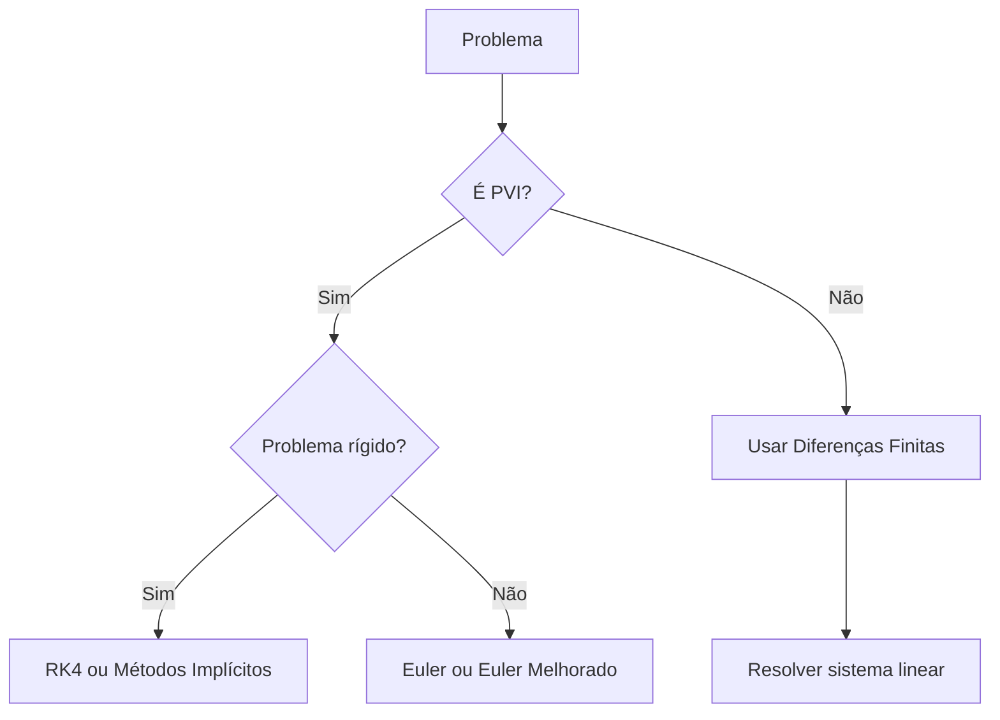

# 📊 Métodos de Diferenças Finitas para Equações Diferenciais Ordinárias

## 📖 Conceitos Fundamentais

### O que são Diferenças Finitas?
> [!note] 
> As **diferenças finitas** são técnicas numéricas que aproximam derivadas por expressões algébricas usando valores da função em pontos discretos.
> ![[Pasted image 20260424073248.png]]
> 

> [!abstract] 
> ### Aproximação da Derivada
Para uma função $f(x)$ com passo $h$ pequeno:
>
| Tipo            | Fórmula                                    | Erro     |
| --------------- | ------------------------------------------ | -------- |
| **Progressiva** | $f'(x) \approx \frac{f(x+h) - f(x)}{h}$    | $O(h)$   |
| **Regressiva**  | $f'(x) \approx \frac{f(x) - f(x-h)}{h}$    | $O(h)$   |
| **Centrada**    | $f'(x) \approx \frac{f(x+h) - f(x-h)}{2h}$ | $O(h^2)$ |
>
>Aqui estão as frases ajustadas:
>
> - **Diferença Finita Progressiva:** Usa ponto atual e próximo para estimar derivada.
> - **Diferença Finita Regressiva:** Usa ponto atual e anterior para aproximar derivada.
> - **Diferença Finita Centrada:** É a média entre as diferenças regressiva e progressiva, sendo mais precisa.
>

### Aproximação da Segunda Derivada
$$f''(x) \approx \frac{f(x+h) - 2f(x) + f(x-h)}{h^2}$$

> [!warning] **Erro:** $O(h^2)$

Aqui está um exemplo usando a função ln(x) (logaritmo natural):

## Exemplo com f(x) = ln(x) no ponto x = 2, com h = 0.1

> [!example]
>
> $$f(x) = ln(x)$$
>
> - $f(2) = ln(2) = 0,693147$
> - $f(2,1) = ln(2,1) = 0,741937$
> - $f(1,9) = ln(1,9) = 0,641854$
>
> ### Aplicando as fórmulas:
> 
> **Diferença Progressiva:**
> $$f'(2) \approx \frac{f(2,1) - f(2)}{0,1} = \frac{0,741937 - 0,693147}{0,1} = \frac{0,04879}{0,1} = 0,4879$$
>
> **Diferença Regressiva:**
>$$f'(2) \approx \frac{f(2) - f(1,9)}{0,1} = \frac{0,693147 - 0,641854}{0,1} = \frac{0,051293}{0,1} = 0,51293$$
> 
> **Diferença Centrada:**
> $$f'(2) \approx \frac{f(2,1) - f(1,9)}{2 \cdot 0,1} = \frac{0,741937 - 0,641854}{0,2} = \frac{0,100083}{0,2} = 0,500415$$
> 
> ### Comparação com a derivada exata:
>
> Derivada exata: $f'(x) = \frac{1}{x} \Rightarrow f'(2) = 0,5$
>
| Método       | Resultado    | Erro         |
| ------------ | ------------ | ------------ |
| Progressiva  | 0,487900     | 0,012100     |
| Regressiva   | 0,512930     | 0,012930     |
| **Centrada** | **0,500415** | **0,000415** |
>
>
> > [!important] A **Diferença Centrada** (média entre progressiva e regressiva) é a mais precisa, com erro 30 vezes menor!

---

## 🎯 Métodos para Problemas de Valor Inicial (PVI)

### 1. Método de Euler (Explícito)
**Mais simples dos métodos**

$$y_{n+1} = y_n + h \cdot f(x_n, y_n)$$

**Características:**
- ✅ Fácil implementação
- ❌ Precisão baixa ($O(h)$)
- ❌ Instável para problemas rígidos

### 2. Método de Euler Melhorado (Heun)
**Predictor-Corrector**

**Predictor:** $y_{n+1}^* = y_n + h \cdot f(x_n, y_n)$

**Corrector:** $y_{n+1} = y_n + \frac{h}{2}[f(x_n, y_n) + f(x_{n+1}, y_{n+1}^*)]$

**Características:**
- ✅ Precisão $O(h^2)$
- ✅ Mais estável que Euler

### 3. Método de Runge-Kutta 4ª Ordem (RK4)
**Mais utilizado para problemas gerais**

$$k_1 = h \cdot f(x_n, y_n)$$
$$k_2 = h \cdot f(x_n + \frac{h}{2}, y_n + \frac{k_1}{2})$$
$$k_3 = h \cdot f(x_n + \frac{h}{2}, y_n + \frac{k_2}{2})$$
$$k_4 = h \cdot f(x_n + h, y_n + k_3)$$

$$y_{n+1} = y_n + \frac{1}{6}(k_1 + 2k_2 + 2k_3 + k_4)$$

**Características:**
- ✅ Alta precisão ($O(h^4)$)
- ✅ Estável para maioria dos problemas
- ❌ Mais computacionalmente caro

---

## 🔧 Métodos para Problemas de Valor de Contorno (PVC)

### Discretização do Domínio
Dividimos $[a,b]$ em $N+1$ pontos:
$$x_i = a + i \cdot h, \quad h = \frac{b-a}{N+1}$$

### Exemplo: Equação de Poisson 1D
$$-y''(x) + p(x)y'(x) + q(x)y(x) = f(x)$$

**Discretização:**
$$-\frac{y_{i+1} - 2y_i + y_{i-1}}{h^2} + p_i \frac{y_{i+1} - y_{i-1}}{2h} + q_i y_i = f_i$$

**Reorganizando:**
$$a_i y_{i-1} + b_i y_i + c_i y_{i+1} = d_i$$

Onde:
- $a_i = -\frac{1}{h^2} - \frac{p_i}{2h}$
- $b_i = \frac{2}{h^2} + q_i$
- $c_i = -\frac{1}{h^2} + \frac{p_i}{2h}$
- $d_i = f_i$

---

## 📈 Comparação dos Métodos

### Tabela Comparativa

| Método | Ordem | Estabilidade | Custo | Aplicação |
|--------|-------|--------------|-------|------------|
| **Euler** | $O(h)$ | Baixa | Baixo | Problemas simples |
| **Euler Melhorado** | $O(h^2)$ | Média | Médio | Iniciantes |
| **RK4** | $O(h^4)$ | Alta | Alto | Problemas gerais |
| **Diferenças Finitas** | $O(h^2)$ | Alta | Médio | PVCs |

### Critérios de Escolha



---

## 💻 Implementações em Python

### Método de Euler
```python
def euler(f, x0, y0, h, n):
    """
    f: função dy/dx = f(x,y)
    x0, y0: condição inicial
    h: passo
    n: número de passos
    """
    x = [x0 + i*h for i in range(n+1)]
    y = [0]*(n+1)
    y[0] = y0
    
    for i in range(n):
        y[i+1] = y[i] + h * f(x[i], y[i])
    
    return x, y
```

### Método RK4
```python
def rk4(f, x0, y0, h, n):
    x = [x0 + i*h for i in range(n+1)]
    y = [0]*(n+1)
    y[0] = y0
    
    for i in range(n):
        k1 = h * f(x[i], y[i])
        k2 = h * f(x[i] + h/2, y[i] + k1/2)
        k3 = h * f(x[i] + h/2, y[i] + k2/2)
        k4 = h * f(x[i] + h, y[i] + k3)
        
        y[i+1] = y[i] + (k1 + 2*k2 + 2*k3 + k4)/6
    
    return x, y
```

### Diferenças Finitas para PVC
```python
import numpy as np

def finite_difference(p, q, f, a, b, ya, yb, n):
    """
    Resolve -y'' + p(x)y' + q(x)y = f(x)
    com condições de contorno y(a)=ya, y(b)=yb
    """
    h = (b - a)/(n + 1)
    x = np.linspace(a, b, n + 2)
    
    # Matriz tridiagonal
    A = np.zeros((n, n))
    B = np.zeros(n)
    
    for i in range(1, n + 1):
        xi = x[i]
        pi = p(xi)
        qi = q(xi)
        fi = f(xi)
        
        a_i = -1/h**2 - pi/(2*h)
        b_i = 2/h**2 + qi
        c_i = -1/h**2 + pi/(2*h)
        
        if i > 1:
            A[i-1, i-2] = a_i
        A[i-1, i-1] = b_i
        if i < n:
            A[i-1, i] = c_i
        
        # Termo fonte
        B[i-1] = fi
        
        # Condições de contorno
        if i == 1:
            B[i-1] -= a_i * ya
        if i == n:
            B[i-1] -= c_i * yb
    
    y_interno = np.linalg.solve(A, B)
    y = np.concatenate(([ya], y_interno, [yb]))
    
    return x, y
```

---

## 📊 Exemplo Prático

### Problema: Crescimento Populacional
$$y' = 0.1y, \quad y(0) = 100$$

**Solução analítica:** $y(t) = 100e^{0.1t}$

### Comparação dos Métodos (t = 5, h = 1)

| Método | Resultado | Erro |
|--------|-----------|------|
| **Analítico** | 164.872 | - |
| **Euler** | 161.051 | 3.821 |
| **Euler Melhorado** | 164.461 | 0.411 |
| **RK4** | 164.872 | < 0.001 |

---

## ⚠️ Erros e Estabilidade

### Erro de Truncamento Local
- **Euler:** $\frac{h^2}{2}y''(\xi)$
- **Euler Melhorado:** $O(h^3)$
- **RK4:** $O(h^5)$

### Erro de Arredondamento
Acumula-se devido às operações de ponto flutuante

### Estabilidade
- **Condição para Euler:** $|1 + h\lambda| \leq 1$ (para $y' = \lambda y$)
- **RK4:** Estável para $|1 + h\lambda + \frac{(h\lambda)^2}{2} + \frac{(h\lambda)^3}{6} + \frac{(h\lambda)^4}{24}| \leq 1$

---

## ✅ Resumo e Recomendações

| Situação | Método Recomendado |
|----------|-------------------|
| **Iniciante/Aprendizado** | Euler ou Euler Melhorado |
| **Problemas gerais** | RK4 |
| **Problemas rígidos** | Métodos implícitos |
| **Problemas de contorno** | Diferenças Finitas |
| **Alta precisão necessária** | RK4 com passo adaptativo |
| **Recursos limitados** | Euler Melhorado |

---

## 📚 Referências

1. Burden, R.L. & Faires, J.D. (2016). *Análise Numérica*
2. Chapra, S.C. (2018). *Métodos Numéricos para Engenheiros*
3. Butcher, J.C. (2016). *Numerical Methods for Ordinary Differential Equations*

---
