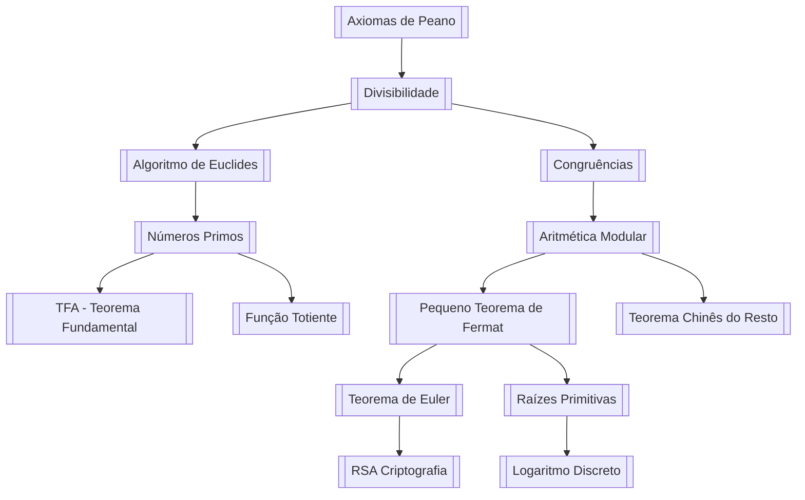

# 📘 Guia Geral de Teoria dos Números

## Fundamentos, Algoritmos e Aplicações

> [!info] **O que é Teoria dos Números?**
> A Teoria dos Números é o ramo da matemática pura que estuda as propriedades dos **números inteiros**, especialmente os **números naturais** $\mathbb{N} = \{1, 2, 3, \dots\}$ e os **inteiros** $\mathbb{Z} = \{\dots, -2, -1, 0, 1, 2, \dots\}$.
> 
> É frequentemente chamada de **"Rainha da Matemática"** ([[Carl Friedrich Gauss]]) por sua beleza e profundidade.
> 
> 🔗 **Notas relacionadas:** [[Introdução à Teoria dos Números]], [[História da Teoria dos Números]]

---

## 1. Fundamentos: Os Números Naturais

> [!definition] **Axiomas de Peano**
> Os [[Axiomas de Peano]] são a base axiomática para os números naturais:
> 1. $0$ (ou $1$) é um número natural
> 2. Todo número natural $n$ tem um **sucessor** $S(n)$
> 3. $0$ não é sucessor de nenhum número
> 4. Números diferentes têm sucessores diferentes (injetividade)
> 5. **Princípio da Indução**: Se um conjunto contém $0$ e o sucessor de cada elemento, então contém todos os naturais

> [!example] **Construindo os naturais:**
> $$0 \xrightarrow{S} 1 \xrightarrow{S} 2 \xrightarrow{S} 3 \xrightarrow{S} 4 \xrightarrow{S} \dots$$
> Onde $S(n) = n+1$

🔗 **Notas relacionadas:** [[Princípio da Indução Finita]], [[Construção dos Números Naturais]], [[Conjuntos Dedekind-infinitos]]

---

## 2. Divisibilidade e Algoritmo da Divisão

> [!definition] **Divisibilidade**
> Dizemos que $a$ **divide** $b$ (notação: $a \mid b$) se existe um inteiro $k$ tal que $b = a \cdot k$.
> 
> **Exemplo:** $3 \mid 12$ porque $12 = 3 \times 4$

> [!theorem] **Algoritmo da Divisão (Euclides)**
> Dados $a, b \in \mathbb{Z}$ com $b > 0$, existem **únicos** inteiros $q$ (quociente) e $r$ (resto) tais que:
> $$ a = b \cdot q + r, \quad \text{com } 0 \le r < b $$

> [!example] **Exemplo prático:**
> $$ 47 \div 5 = 9 \text{ com resto } 2 \quad \Rightarrow \quad 47 = 5 \times 9 + 2 $$
> $$ -17 \div 4: \quad -17 = 4 \times (-5) + 3 \quad (\text{resto } 3, \text{ não } -1!) $$

> [!note] **Importante:** O resto sempre é **não negativo**! No segundo exemplo, $-17 = 4 \times (-5) + 3$, não $4 \times (-4) + (-1)$.

🔗 **Notas relacionadas:** [[Algoritmo da Divisão]], [[Resto e Quociente]], [[Divisibilidade Propriedades]]

---

## 3. Máximo Divisor Comum (MDC) e Algoritmo de Euclides

> [!definition] **Máximo Divisor Comum (MDC)**
> O **mdc** de dois inteiros $a$ e $b$ (não ambos nulos) é o maior inteiro positivo que divide ambos.
> 
> Notação: $\operatorname{mdc}(a, b)$ ou $\gcd(a, b)$

> [!theorem] **Algoritmo de Euclides**
> Para calcular $\operatorname{mdc}(a, b)$:
> $$ \operatorname{mdc}(a, b) = \operatorname{mdc}(b, r) $$
> onde $r$ é o resto da divisão de $a$ por $b$.

> [!example] **Cálculo manual: $\operatorname{mdc}(252, 105)$**
> 
> $252 = 105 \times 2 + 42$ (resto $42$)
> $105 = 42 \times 2 + 21$ (resto $21$)
> $42 = 21 \times 2 + 0$ (resto $0$)
> 
> **Resultado:** $\operatorname{mdc}(252, 105) = 21$

> [!tip] **Algoritmo de Euclides Estendido**
> Encontra inteiros $x, y$ tais que:
> $$ \operatorname{mdc}(a, b) = ax + by $$
> 
> **Exemplo:** $21 = 252 \times (-1) + 105 \times 3$

🔗 **Notas relacionadas:** [[Algoritmo de Euclides]], [[Algoritmo de Euclides Estendido]], [[MDC - Propriedades]], [[Combinação Linear]] , [[Números Primos Entre Si]]

---

## 4. Números Primos

> [!definition] **Números Primos e Compostos**
> - **Primo:** Um inteiro $p > 1$ cujos únicos divisores positivos são $1$ e $p$
> - **Composto:** Inteiro $> 1$ que não é primo
> 
> **Exemplos:** Primos: $2, 3, 5, 7, 11, 13, 17, 19, 23, 29, \dots$

> [!theorem] **Teorema Fundamental da Aritmética**
> **Todo inteiro $n > 1$ pode ser escrito de forma única (a menos da ordem) como um produto de primos:**
> $$ n = p_1^{e_1} \cdot p_2^{e_2} \cdots p_k^{e_k} $$
> 
> **Exemplo:** $360 = 2^3 \times 3^2 \times 5^1$

> [!theorem] **Infinitude dos Primos (Euclides)**
> Existem infinitos números primos.
> 
> **Prova (resumo):** Suponha primos finitos $p_1, p_2, \dots, p_k$. O número $N = p_1p_2\cdots p_k + 1$ não é divisível por nenhum primo conhecido → contradição.

> [!warning] **Crivo de Eratóstenes**
> Método para encontrar todos os primos até $n$:
> 1. Liste $2, 3, 4, \dots, n$
> 2. Marque $2$ como primo, risque seus múltiplos
> 3. Próximo não riscado é primo, risque seus múltiplos
> 4. Repita até $\sqrt{n}$

🔗 **Notas relacionadas:** [[Teorema Fundamental da Aritmética]], [[Crivo de Eratóstenes]], [[Distribuição dos Primos]], [[Teorema dos Números Primos]], [[Primos de Mersenne]], [[Números Primos Gêmeos]], [[Teste de Primalidade]], [[Fatoração Inteira]]

---

## 5. Congruências e Aritmética Modular

> [!definition] **Congruência Módulo $m$**
> Dizemos que $a \equiv b \pmod{m}$ se $m \mid (a - b)$.
> 
> **Exemplo:** $17 \equiv 2 \pmod{5}$ porque $17 - 2 = 15$ é divisível por $5$

> [!property] **Propriedades das Congruências**
> 1. $a \equiv a \pmod{m}$ (reflexiva)
> 2. $a \equiv b \Rightarrow b \equiv a$ (simétrica)
> 3. $a \equiv b$ e $b \equiv c \Rightarrow a \equiv c$ (transitiva)
> 4. Se $a \equiv b$ e $c \equiv d$, então:
>    - $a + c \equiv b + d \pmod{m}$
>    - $a \cdot c \equiv b \cdot d \pmod{m}$

> [!example] **Cálculo de resto (módulo 7)**
> Qual o resto de $5^{100}$ por $7$?
> 
> $5 \equiv 5 \pmod{7}$
> $5^2 = 25 \equiv 4 \pmod{7}$
> $5^3 \equiv 5 \times 4 = 20 \equiv 6 \pmod{7}$
> $5^4 \equiv 5 \times 6 = 30 \equiv 2 \pmod{7}$
> $5^5 \equiv 5 \times 2 = 10 \equiv 3 \pmod{7}$
> $5^6 \equiv 5 \times 3 = 15 \equiv 1 \pmod{7}$
> 
> Como $5^6 \equiv 1$, então $5^{100} = 5^{6 \times 16 + 4} \equiv (5^6)^{16} \times 5^4 \equiv 1^{16} \times 2 = 2 \pmod{7}$

🔗 **Notas relacionadas:** [[Aritmética Modular]], [[Congruências Lineares]], [[Sistemas de Congruências]], [[Classes de Resíduos]], [[Anel Z/mZ]]

---

## 6. Teorema Chinês do Resto

> [!theorem] **Teorema Chinês do Resto (TCR)**
> Sejam $m_1, m_2, \dots, m_k$ **dois a dois primos entre si**. O sistema:
> 
> $$ \begin{cases}
> x \equiv a_1 \pmod{m_1} \\
> x \equiv a_2 \pmod{m_2} \\
> \hspace{1.5cm} \vdots \\
> x \equiv a_k \pmod{m_k}
> \end{cases} $$
> 
> Tem solução **única** módulo $M = m_1 m_2 \cdots m_k$.

> [!example] **Exemplo prático:**
> Resolva:
> $$ \begin{cases}
> x \equiv 2 \pmod{3} \\
> x \equiv 3 \pmod{5} \\
> x \equiv 2 \pmod{7}
> \end{cases} $$
> 
> **Solução:**
> 1. $x \equiv 2 \pmod{3} \Rightarrow x = 2 + 3t$
> 2. $2 + 3t \equiv 3 \pmod{5} \Rightarrow 3t \equiv 1 \pmod{5} \Rightarrow t \equiv 2 \pmod{5}$
> 3. $t = 2 + 5u \Rightarrow x = 2 + 3(2 + 5u) = 8 + 15u$
> 4. $8 + 15u \equiv 2 \pmod{7} \Rightarrow 15u \equiv -6 \equiv 1 \pmod{7}$
> 5. $15 \equiv 1 \pmod{7} \Rightarrow u \equiv 1 \pmod{7} \Rightarrow u = 1 + 7v$
> 6. $x = 8 + 15(1 + 7v) = 23 + 105v$
> 
> **Resposta:** $x \equiv 23 \pmod{105}$ (verifique: $23 \bmod 3 = 2$, $\bmod 5 = 3$, $\bmod 7 = 2$)

🔗 **Notas relacionadas:** [[Teorema Chinês do Resto]], [[Aplicações do TCR]], [[Sistemas Lineares Congruenciais]]

---

## 7. Pequeno Teorema de Fermat e Teorema de Euler

> [!theorem] **Pequeno Teorema de Fermat (PTF)**
> Se $p$ é primo e $p \nmid a$, então:
> $$ a^{p-1} \equiv 1 \pmod{p} $$
> 
> **Exemplo:** $2^{10} = 1024 \equiv 1 \pmod{11}$ (pois $1024 - 1 = 1023 = 11 \times 93$)

> [!theorem] **Teorema de Euler (generalização)**
> Se $\operatorname{mdc}(a, n) = 1$, então:
> $$ a^{\varphi(n)} \equiv 1 \pmod{n} $$
> 
> Onde $\varphi(n)$ é a **Função Totiente de Euler** (quantos $< n$ são primos com $n$)

> [!definition] **Função Totiente de Euler**
> $\varphi(n) = n \displaystyle\prod_{p \mid n} \left(1 - \frac{1}{p}\right)$, onde o produto é sobre os primos que dividem $n$.
> 
> **Exemplos:**
> - $\varphi(10) = 10 \times (1 - 1/2) \times (1 - 1/5) = 10 \times 1/2 \times 4/5 = 4$
> - Os números $< 10$ primos com $10$: $1, 3, 7, 9$ (confirmando $\varphi(10)=4$)

> [!example] **Aplicação do Teorema de Euler:**
> Calcular $7^{100} \bmod 10$:
> - $\varphi(10) = 4$
> - $7^4 \equiv 1 \pmod{10}$ (pois $7^2=49 \equiv 9$, $7^4 \equiv 9^2=81 \equiv 1$)
> - $7^{100} = 7^{4 \times 25} \equiv 1^{25} = 1 \pmod{10}$

🔗 **Notas relacionadas:** [[Pequeno Teorema de Fermat]], [[Teorema de Euler]], [[Função Totiente de Euler]], [[Pseudoprimos]], [[Primos de Fermat]]

---

## 8. Criptografia RSA

> [!info] **O que é RSA?**
> O [[RSA (criptografia)]] é um sistema de criptografia assimétrica baseado na dificuldade de fatorar números grandes e no Teorema de Euler.

> [!example] **Passos do RSA:**
> 
> 1. **Escolha $p$ e $q$ primos grandes:** $p=61$, $q=53$
> 2. **Calcule $n = p \times q = 3233$**
> 3. **Calcule $\varphi(n) = (p-1)(q-1) = 60 \times 52 = 3120$**
> 4. **Escolha $e$ (público) primo com $\varphi(n)$:** $e = 17$
> 5. **Calcule $d$ (privado) tal que $e \times d \equiv 1 \pmod{\varphi(n)}$:**
>    - $d = 2753$ (pois $17 \times 2753 = 46801 \equiv 1 \pmod{3120}$)
> 
> **Criptografar $M$ (mensagem):** $C \equiv M^e \pmod{n}$
> **Descriptografar $C$:** $M \equiv C^d \pmod{n}$

> [!note] **Por que funciona?**
> $C^d \equiv (M^e)^d = M^{ed} \equiv M^{k\varphi(n)+1} \equiv M \pmod{n}$ pelo Teorema de Euler.

🔗 **Notas relacionadas:** [[RSA (criptografia)]], [[Criptografia Assimétrica]], [[Números Primos Grandes]], [[Fatoração Inteira - Dificuldade]]

---

## 9. Equações Diofantinas Lineares

> [!definition] **Equação Diofantina Linear**
> Equação da forma:
> $$ ax + by = c $$
> com $a, b, c \in \mathbb{Z}$, buscando soluções inteiras $(x, y)$.

> [!theorem] **Condição de Solubilidade**
> A equação $ax + by = c$ tem solução inteira **se e somente se** $\operatorname{mdc}(a, b) \mid c$.

> [!example] **Resolver $6x + 9y = 21$**
> 1. $\operatorname{mdc}(6, 9) = 3$ e $3 \mid 21$ → tem solução
> 2. Divida por $3$: $2x + 3y = 7$
> 3. Solução particular: $x_0 = 2, y_0 = 1$ (pois $4+3=7$)
> 4. Solução geral: $x = 2 + 3t$, $y = 1 - 2t$, $t \in \mathbb{Z}$
> 
> **Verificação:** $6(2+3t) + 9(1-2t) = 12 + 18t + 9 - 18t = 21$

🔗 **Notas relacionadas:** [[Equações Diofantinas]], [[Soluções de Equações Lineares]], [[Algoritmo de Euclides Estendido - Aplicacoes]]

---

## 10. Raízes Primitivas e Logaritmos Discretos

> [!definition] **Ordem de um elemento módulo $n$**
> A **ordem** de $a$ módulo $n$ é o menor $k > 0$ tal que $a^k \equiv 1 \pmod{n}$.

> [!definition] **Raiz Primitiva**
> $g$ é uma **raiz primitiva** módulo $n$ se sua ordem é $\varphi(n)$. Ou seja, $\{g, g^2, \dots, g^{\varphi(n)}\}$ gera todos os invertíveis módulo $n$.

> [!example] **Exemplo com $n = 7$ ($\varphi(7)=6$)**
> $3$ é raiz primitiva módulo $7$:
> - $3^1 = 3$
> - $3^2 = 9 \equiv 2$
> - $3^3 \equiv 3 \times 2 = 6$
> - $3^4 \equiv 3 \times 6 = 18 \equiv 4$
> - $3^5 \equiv 3 \times 4 = 12 \equiv 5$
> - $3^6 \equiv 3 \times 5 = 15 \equiv 1$
> 
> Geramos $\{1,2,3,4,5,6\}$ (todos os invertíveis).

> [!definition] **Logaritmo Discreto**
> Se $g$ é raiz primitiva módulo $n$, então $\log_g(a)$ é o $k$ tal que $g^k \equiv a \pmod{n}$.

> [!warning] **Dificuldade Computacional**
> Calcular $\log_g(a)$ é **muito difícil** para números grandes (base da criptografia de [[Curvas Elípticas]] e [[Diffie-Hellman]]).

🔗 **Notas relacionadas:** [[Raízes Primitivas]], [[Logaritmo Discreto]], [[Criptografia de Curvas Elípticas]], [[Protocolo Diffie-Hellman]]

---

## 11. Números de Fibonacci e Sequências Recorrentes

> [!definition] **Sequência de Fibonacci**
> $$ F_0 = 0,\quad F_1 = 1,\quad F_{n} = F_{n-1} + F_{n-2} $$
> 
> **Termos:** $0, 1, 1, 2, 3, 5, 8, 13, 21, 34, 55, 89, 144, \dots$

> [!theorem] **Fórmula de Binet**
> $$ F_n = \frac{\varphi^n - \psi^n}{\sqrt{5}} $$
> onde $\varphi = \frac{1+\sqrt{5}}{2}$ ([[Proporção Áurea]]) e $\psi = \frac{1-\sqrt{5}}{2}$

> [!property] **Propriedades importantes**
> 1. $\operatorname{mdc}(F_m, F_n) = F_{\operatorname{mdc}(m,n)}$ (identidade de [[Gabriel Lamé]])
> 2. $F_{n+1} \cdot F_{n-1} - F_n^2 = (-1)^n$
> 3. $F_{kn}$ é múltiplo de $F_n$

> [!example] **Em quantos zeros termina $F_{50}$?**
> (Exercício de Teoria dos Números → usar propriedades de divisibilidade)

🔗 **Notas relacionadas:** [[Números de Fibonacci]], [[Sequência de Fibonacci]], [[Proporção Áurea]], [[Identidade de Cassini]], [[Aplicações de Fibonacci]]

---

## 12. Aplicações Avançadas (Visão Geral)

> [!summary] **Aplicações da Teoria dos Números**

| Área | Aplicação | Conceitos Envolvidos |
|------|-----------|---------------------|
| **Criptografia** | RSA, Diffie-Hellman | [[Números Primos]], [[Aritmética Modular]], [[Logaritmo Discreto]] |
| **Ciência da Computação** | Hashing, Sorteadores | [[Números Aleatórios]], [[Teste de Primalidade]] |
| **Teoria de Códigos** | Códigos de Barras, QR | [[Aritmética Modular]], [[Anéis Finitos]] |
| **Música** | Temperamento Igual | [[Frações]] e [[Logaritmos]] |
| **Teoria dos Grafos** | Grafos de Cayley | [[Teoria dos Grupos]], [[Congruências]] |

🔗 **Notas relacionadas:** [[Aplicações da Teoria dos Números]], [[Teoria dos Números na Computação]], [[Números na Natureza]]

---

## 13. Tabela de Referência Rápida

> [!tldr] **Conceitos e Notações Essenciais**

| Conceito | Notação | Definição |
|----------|---------|-----------|
| Divisibilidade | $a \mid b$ | $b = a \cdot k$ |
| MDC | $\gcd(a,b)$ | Maior divisor comum |
| Congruência | $a \equiv b \pmod{m}$ | $m \mid (a-b)$ |
| Classe de resto | $\bar{a}$ ou $[a]_m$ | $\{a + km \mid k \in \mathbb{Z}\}$ |
| Função Totiente | $\varphi(n)$ | Quantos $< n$ são primos com $n$ |
| Números primos | $\mathbb{P}$ | $\{2, 3, 5, 7, 11, \dots\}$ |
| Parte inteira | $\lfloor x \rfloor$ | Maior inteiro $\le x$ |

---

## 14. Problemas Clássicos e Desafios (Abertos)

> [!question] **Problemas em Aberto (Millennium Prize)**
> - [[Hipótese de Riemann]]: Relaciona zeros da função zeta com distribuição dos primos
> - [[Conjectura de Goldbach]]: Todo número par $> 2$ é soma de dois primos
> - [[Conjectura dos Primos Gêmeos]]: Infinitos pares $(p, p+2)$ amb os primos
> - [[O Problema de Fermat]] (último teorema) - **Resolvido** (Andrew Wiles, 1995)

> [!exercise] **Problema para praticar:**
> **1.** Mostre que $\sqrt{2}$ é irracional. *Dica: Use decomposição em primos.*
> **2.** Encontre todos os inteiros $n$ tais que $n^2 - 3n + 2$ é primo.
> **3.** Calcule $2^{1000} \bmod 31$ usando o PTF.
> **4.** Resolva: $x \equiv 2 \pmod{4}$, $x \equiv 3 \pmod{5}$.
> **5.** Quantos números $\le 1000$ são divisíveis por 2 ou 3?

🔗 **Notas relacionadas:** [[Lista de Problemas - Teoria dos Números]], [[Demonstrações Famosas]], [[Problemas em Aberto]]

---

## 15. Referências e Links para Estudo

> [!cite] **Bibliografia Recomendada**
> - [[Números e Funções]] (Lima, Elon L.)
> - [[Elementary Number Theory]] (David M. Burton)
> - [[An Introduction to the Theory of Numbers]] (Niven, Zuckerman, Montgomery)
> - [[A Classical Introduction to Modern Number Theory]] (Ireland, Rosen)

> [!link] **Recursos Online**
> - [[OEIS]] - Enciclopédia Online de Sequências Inteiras
> - [[Project Euler]] - Problemas de programação e teoria dos números
> - [[Wolfram MathWorld - Number Theory]]

🔗 **Próximos tópicos sugeridos:** 
[[Teoria Algébrica dos Números]], [[Teoria Analítica dos Números]], [[Curvas Elípticas]], [[Corpos de Classe]], [[Função Zeta de Riemann]]

---

## 16. Mapa de Estudos (Sugestão de Ordem)

---

## 17. Exercício Final (Desafio Integrador)

> [!challenge] **Prove que $n^5 - n$ é sempre divisível por 30 para todo inteiro $n$**
> 
> **Dicas:**
> - Use o [[Pequeno Teorema de Fermat]] para módulo 5
> - Analise módulo 2 e 3 separadamente
> - Combine usando o [[Teorema Chinês do Resto]]

**Solução (resumo):**
- $n^5 \equiv n \pmod{5}$ por Fermat
- $n^5 - n = n(n^4 - 1) = n(n^2 - 1)(n^2 + 1)$
- Produto de 3 inteiros consecutivos $\Rightarrow$ divisível por $6$ (2 e 3)
- Combinando com divisibilidade por 5 e mdc(6,5)=1 → divisível por 30

🔗 **Resposta completa:** [[Prova n^5-n divisível por 30]]

---

## Conclusão

> [!success] **Teoria dos Números** é um campo vasto e belo da matemática, com conexões profundas entre teoria abstrata e aplicações práticas (como a criptografia moderna). Estudar este guia com os [[links internos]] permitirá que você construa um **mapa mental conectado** do conhecimento.

> [!tip] **Sugestão:** Crie uma pasta `Teoria dos Números` no seu Obsidian e gere cada nota `[[...]]` separadamente. O conhecimento se torna um **grafo de conceitos** interligados!
