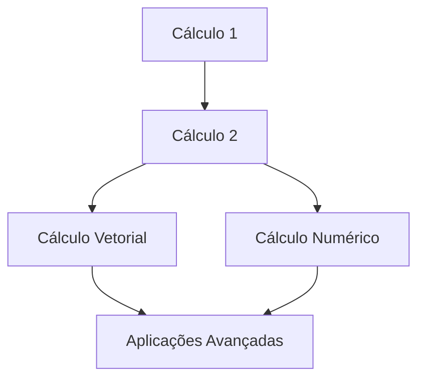

> [!quote] _"O cálculo é a linguagem da natureza e da engenharia."_ - Isaac Newton & Gottfried Leibniz

---

## 🎯 **O que é o Cálculo?**

O **Cálculo** é um ramo da matemática que estuda **mudanças** e **acumulação**. Foi desenvolvido independentemente por Isaac Newton e Gottfried Leibniz no século XVII para resolver problemas relacionados ao movimento, áreas, volumes e taxas de variação.

### **Conceitos Fundamentais:**

- **Limite**: Base de toda a teoria do cálculo
- **Derivada**: Taxa de variação instantânea
- **Integral**: Acumulação e área sob curvas
- **Continuidade**: Comportamento suave de funções

---

## 🔬 **O que o Cálculo Estuda?**

### **Principais Áreas de Estudo:**

- **Análise de Funções**: Comportamento, crescimento e decrescimento
- **Otimização**: Máximos e mínimos de funções
- **Taxas de Variação**: Como grandezas mudam no tempo/espaço
- **Áreas e Volumes**: Cálculo de regiões e sólidos complexos
- **Equações Diferenciais**: Modelos matemáticos de fenômenos naturais
- **Séries e Sequências**: Aproximações e convergência

---

## 🌍 **Aplicações do Cálculo**

### **Ciências Exatas:**

- **Física**: Mecânica, eletromagnetismo, termodinâmica
- **Química**: Cinética química, equilíbrio
- **Astronomia**: Órbitas planetárias, dinâmica celestial

### **Engenharias:**

- **Civil**: Estruturas, resistência dos materiais
- **Elétrica**: Circuitos, sinais, controle
- **Mecânica**: Dinâmica de fluidos, transferência de calor
- **Computação**: Algoritmos, otimização, machine learning

### **Ciências Aplicadas:**

- **Economia**: Otimização de lucros, análise marginal
- **Biologia**: Crescimento populacional, epidemiologia
- **Medicina**: Farmacocinética, análise de imagens
- **Estatística**: Análise de dados, inferência

---

## 📚 **Trilha de Aprendizagem**

### **Sequência Recomendada:**

---

## 📖 **1. Cálculo 1 (Diferencial e Integral)**

> [!info] **Fundação do Cálculo** Base essencial para todos os outros cálculos. Estuda funções de uma variável real.

### **O que é:**

Introdução aos conceitos fundamentais de limites, derivadas e integrais para funções de uma variável.

### **Aplicações Práticas:**

- Análise de crescimento/decrescimento
- Otimização de problemas reais
- Cálculo de áreas e volumes simples
- Modelagem de fenômenos com uma variável

---

## 📈 **2. Cálculo 2 (Funções de Várias Variáveis)**

> [!info] **Expansão Multidimensional** Extensão dos conceitos do Cálculo 1 para múltiplas variáveis.

### **O que é:**

Estuda funções que dependem de mais de uma variável, introduzindo conceitos como derivadas parciais e integrais múltiplas.

### **Aplicações Práticas:**

- Otimização com múltiplas variáveis
- Análise de superfícies
- Cálculo de volumes complexos
- Modelagem de sistemas multivariáveis

---

## 🧭 **3. Cálculo Vetorial**

> [!info] **Matemática do Espaço** Ferramentas matemáticas para trabalhar com campos vetoriais e fenômenos tridimensionais.

### **O que é:**

Estuda campos vetoriais, operadores diferenciais vetoriais e teoremas fundamentais que conectam integrais de linha, superfície e volume.

### **Aplicações Práticas:**

- Eletromagnetismo (equações de Maxwell)
- Dinâmica de fluidos
- Análise de fluxos
- Gravitação e campos de força

---

## 💻 **4. Cálculo Numérico**

> [!info] **Cálculo Computacional** Métodos para resolver problemas de cálculo usando aproximações numéricas e algoritmos.

### **O que é:**

Desenvolve técnicas computacionais para resolver problemas matemáticos que não possuem soluções analíticas exatas.

### **Aplicações Práticas:**

- Simulações computacionais
- Análise de dados experimentais
- Modelagem de sistemas complexos
- Algoritmos de machine learning

---

## 🗺️ **Ordem de Estudo Recomendada**

### **📅 Cronograma Sugerido:**

|Semestre|Disciplina|Pré-requisito|Carga Horária|
|---|---|---|---|
|1º|[[Cálculo 1]]|Matemática Básica|4-6 meses|
|2º|[[Cálculo 2]]|Cálculo 1|4-6 meses|
|3º|[[Cálculo Vetorial]]|Cálculo 2|3-4 meses|
|3º/4º|[[Cálculo Numérico]]|Cálculo 1 + Programação|3-4 meses|

### **🎯 Dependências:**

- **Cálculo 2** depende fortemente do **Cálculo 1**
- **Cálculo Vetorial** é extensão natural do **Cálculo 2**
- **Cálculo Numérico** pode ser estudado após **Cálculo 1**, mas idealmente após **Cálculo 2**

---

## 🎓 **Dicas de Estudo**

> [!tip] **Para Ter Sucesso**
> 
> 1. **Pratique regularmente** - Cálculo requer prática constante
> 2. **Entenda os conceitos** antes de memorizar fórmulas
> 3. **Visualize graficamente** sempre que possível
> 4. **Conecte teoria com aplicações** práticas
> 5. **Use software** (GeoGebra, Wolfram Alpha) para verificar resultados

> [!warning] **Erros Comuns**
> 
> - Pular etapas nos cálculos
> - Não verificar domínios de funções
> - Confundir notações entre disciplinas
> - Não praticar exercícios suficientes

---

## 🔗 **Conexões Interdisciplinares**

### **Aplicações Profissionais:**

- **Engenharias** - Todos os tipos
- **Física** - Teórica e aplicada
- **Ciência da Computação** - Algoritmos e IA
- **Economia** - Modelagem econômica
- **Ciências Biológicas** - Modelagem populacional

---

## 📊 **Resumo da Jornada**

|Aspecto|Cálculo 1|Cálculo 2|Cálculo Vetorial|Cálculo Numérico|
|---|---|---|---|---|
|**Foco**|1 variável|Várias variáveis|Campos vetoriais|Métodos computacionais|
|**Dificuldade**|⭐⭐⭐|⭐⭐⭐⭐|⭐⭐⭐⭐⭐|⭐⭐⭐|
|**Aplicação**|Básica|Intermediária|Avançada|Prática|

---

**O cálculo é uma jornada fascinante que abre portas para compreender e modelar o mundo ao nosso redor!** 🚀

---

_Tags_: #calculo #matematica #derivadas #integrais #limites #funcoes #aplicacoes